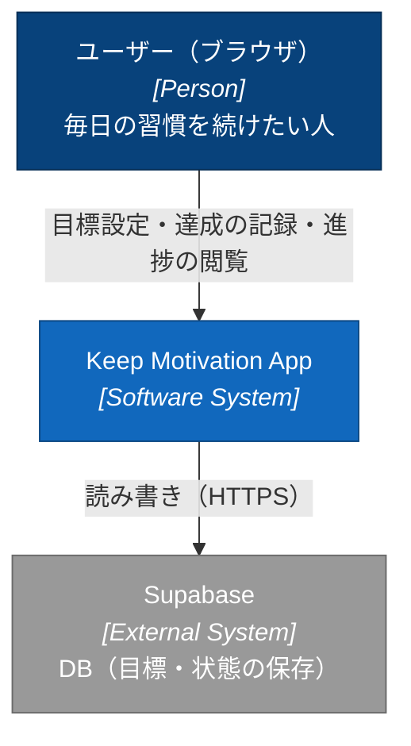
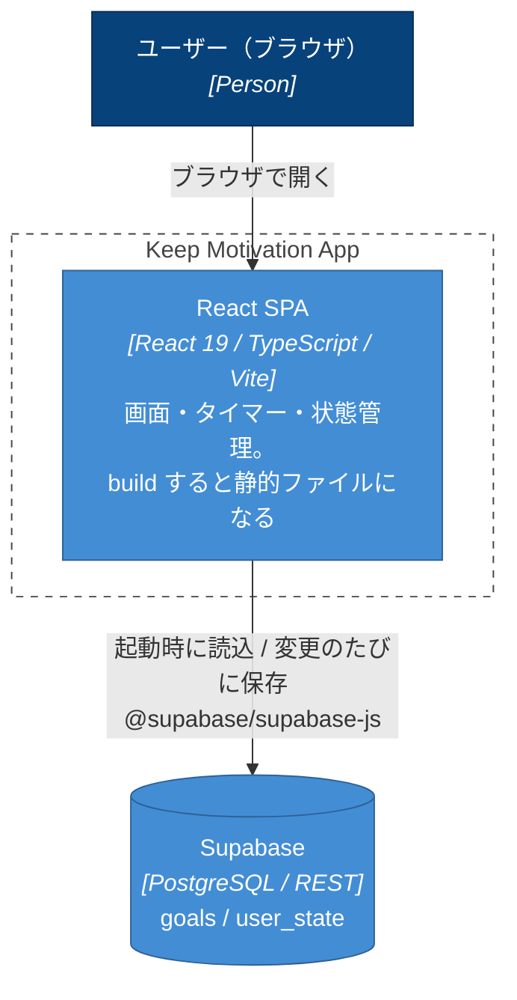
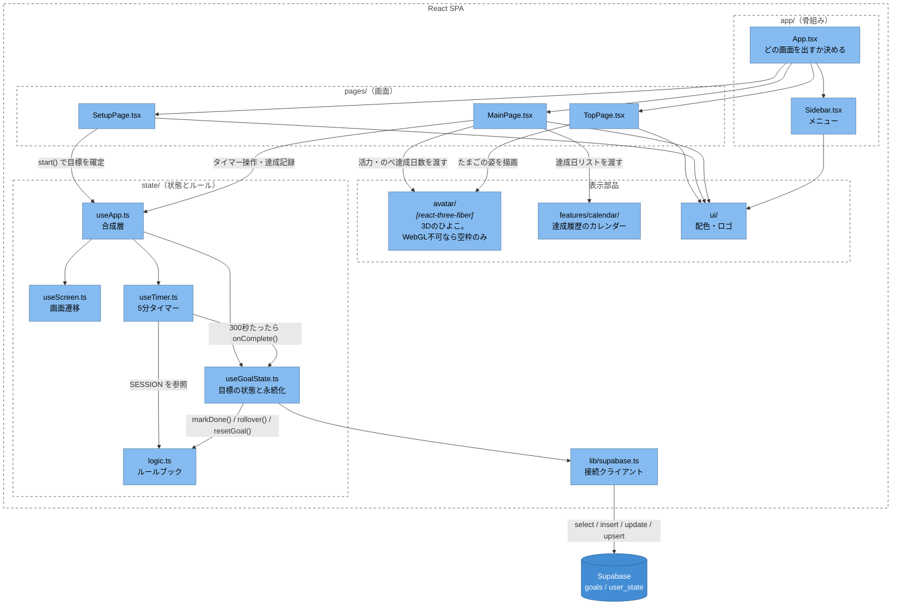
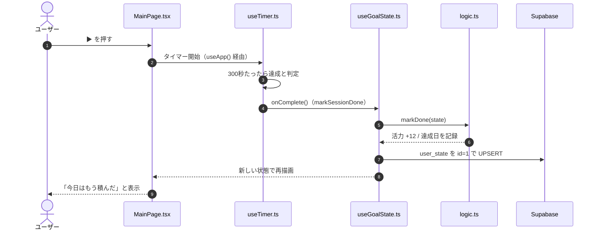
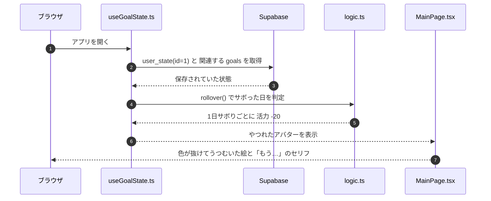
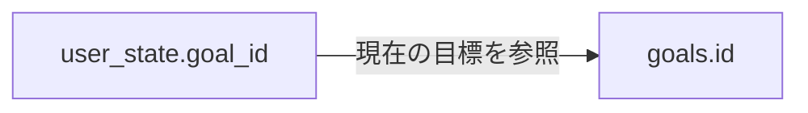

# アーキテクチャ — 何がどう動いているか

このアプリの見取り図です。**構成・データの持ち方・置き場所・既知の課題**をまとめています。
アプリの機能と環境構築は [README.md](./README.md)、分担とルールは [TEAM.md](./TEAM.md) を参照。

> 図は GitHub 上で Mermaid として自動表示されます。

---

## 1. 全体像

### 誰が使うか（C4: System Context）



### 何が動いているか（C4: Container）



- **自前のバックエンドはありません。** `npm run build` すると HTML / JS / CSS になるだけで、
  常駐するサーバープロセスがありません。DB アクセスは Supabase が直接受けます
- `Vite` はビルド時だけの道具なので、実行時のコンテナとしては描いていません
- 3D 描画（three.js）は独立したコンテナではなく、SPA の中の一部品です

---

## 2. `src/` の構造

```text
src/
├── main.tsx                    エントリポイント。App を描画する
├── vite-env.d.ts               Vite の型定義
│
├── app/                        画面の骨組み
│   ├── App.tsx                   どの画面を出すか決める。状態は持たない
│   └── Sidebar.tsx               メニュー（トップ/目標設定/ダッシュボード）
│
├── pages/                      画面（1画面 = 1ファイル）
│   ├── TopPage.tsx               トップ
│   ├── SetupPage.tsx             目標設定
│   ├── MainPage.tsx              ダッシュボード
│   ├── main-page.css
│   └── onboarding-page.css
│
├── features/
│   └── calendar/               カレンダー機能一式
│       ├── Calendar.tsx          週表示（達成率・連続日数の集計もここ）
│       ├── MonthlyCalendar.tsx   月表示（Calendar.tsx から呼ばれる）
│       └── calendar.css
│
├── state/                      状態とルール
│   ├── useApp.ts                 合成層。下の3つを1つのAPIにまとめる
│   ├── useScreen.ts              画面遷移だけ
│   ├── useTimer.ts               5分タイマーだけ
│   ├── useGoalState.ts           目標の状態管理と Supabase の読み書き
│   └── logic.ts                  ルールブック。活力計算・達成判定・日付計算
│
├── lib/
│   └── supabase.ts             DB の接続クライアント
│
├── avatar/                     アバターの3D描画 → README.md に詳細
│   ├── Avatar.tsx / AvatarCanvas.tsx / Chick.tsx
│   ├── look.ts / stage.ts / avatar.css
│   ├── models/                   chick.blend / chick.glb / export_glb.py
│   └── docs/                     Blender の作業メモ
│
└── ui/                         見た目の共通部品
    ├── Logo.tsx / useAccent.ts / styles.css
```

### つながり（C4: Component）



読み方のポイント:

- **`App.tsx` は画面遷移だけ**を担当し、状態そのものは持ちません
- **`useApp.ts` は唯一の「状態のリモコン」**ですが、中身は3つの hook の合成層です。
  分けている理由は**変化する理由が別々**だから（画面が増える／タイマー仕様が変わる／保存先が変わる）。
  `useApp()` が返す API は分割前と同じなので、呼び出し側はこの分割を意識しなくて済みます
- **`logic.ts` は UI を持たない純粋なルール**（活力の増減、サボり判定、日付計算）。
  3つの hook はここの定数・関数を呼ぶだけで、ロジックそのものは持ちません
- **`avatar/` の見た目は3Dの一種類だけ**です。WebGL が使えない／初期化に失敗した場合は、
  レイアウトを保つための空枠だけが残ります（`Avatar.tsx` の `WebGLBoundary`）
- **`features/calendar/`** は機能ひとまとまりの置き場。機能が増えたら `features/` にフォルダを足します

---

## 3. データの流れ

### 5分やりきったとき



（`useApp.ts` はこの呼び出しを配線する合成層で、図では省略しています。
「記録だけつける」ボタンは、タイマーを飛ばして `markSessionDone` を直接呼ぶ同じ流れです。）

### アプリを開いたとき（やつれ判定）



---

## 4. データモデル

接続クライアントは [`src/lib/supabase.ts`](./src/lib/supabase.ts)、読み書きは
[`src/state/useGoalState.ts`](./src/state/useGoalState.ts) に閉じています。
環境変数は [`.env.example`](./.env.example) を参照。



> 以下の型は**アプリ側の型**です。DDL / マイグレーションはリポジトリに無いため、
> SQL の型・主キー・NULL 制約・デフォルト値・インデックス・RLS ポリシーは未確認です。

### `goals` — 目標

| カラム | アプリ上の型 | 内容 |
| --- | --- | --- |
| `id` | `number` | 目標ID。作成時は送らず、返ってきた値を使う |
| `goal` | `string` | 目標の文章 |
| `deadline` | `string` / `null` | 期限（`YYYY-MM-DD`） |
| `frequency` | `Frequency` | `everyday` / `week3` / `week1` / `any`（表示名: 毎日 / 週3回 / 週1回 / 決めてない） |

### `user_state` — 現在の状態

| カラム | アプリ上の型 | 内容 |
| --- | --- | --- |
| `id` | `number` | **現在は `1` 固定** |
| `goal_id` | `number` / `null` | 取り組んでいる目標のID |
| `vitality` | `number` | 活力（0〜100） |
| `avatar_id` | `0` / `1` / `2` | もりお / だいち / こむぎ |
| `name` | `string` | アバターの名前 |
| `done` | `string[]` | 達成日リスト（`YYYY-MM-DD`） |
| `best` | `number` | 最長連続達成日数 |

### 読み書きの対応

| 操作 | DBへの処理 | アプリ側 |
| --- | --- | --- |
| 起動 | `user_state`(id=1) を `maybeSingle()`。関連 `goals` も同時取得 | State に変換し `rollover()` を適用 |
| 目標作成 | `goals` に INSERT して `id` を得る | 活力50・履歴空・最長記録0 にリセット |
| 状態保存 | `user_state` を id=1 で UPSERT | `loaded && hasStarted` のとき変更に応じて |
| 今日の達成 | 状態保存を通じて更新 | 達成日を追加し活力 +12。同日の重複は加算しない |
| 次の日へ進める | 状態保存を通じて更新 | 日付を進め、未達成日ぶん活力 -20 |
| 期限延長 | `goals.deadline` を UPDATE | 成功後に画面の期限を1か月延長 |
| 目標の作り直し | **書き換えない** | `hasStarted=false` にして設定画面へ |
| 全体リセット | **削除しない** | ローカルの状態を初期値に戻す |

### 初期値と補完

アプリ側の値であり、DB のデフォルト値ではありません。

| 項目 | 起動時 | DB値が null の場合 | 目標作成成功時 |
| --- | --- | --- | --- |
| `vitality` | `62` | `100` | `50` |
| `goalId` | `null` | `null` | 作成された目標ID |
| `goal` | `資格の勉強` | 空文字 | 入力値 |
| `deadline` | `null` | `null` | 入力値 |
| `frequency` | `any` | `any` | 入力値 |
| `avatarId` | `0` | `0` | 入力値 |
| `name` | `もりお` | 空文字 | 入力値 |
| `done` / `best` | `[]` / `0` | `[]` / `0` | `[]` / `0` |

### DBに保存していないもの

| 項目 | 用途 | 再読み込み時 |
| --- | --- | --- |
| `lastDate` | 最後に日付更新を処理した日 | `null` に戻り、読み込み時の `rollover()` で当日を設定 |
| `dayOffset` | デバッグ用の日送り | `0` に戻る |
| `loaded` / `hasStarted` | 読み込み・開始状況 | hook 内で再設定 |
| 画面・タイマーの状態 | 現在の画面、経過秒数 | 保存していない |

---

## 5. 既知の制約・課題

**データまわり**

- **ユーザーの区別がありません。** すべての操作が `user_state.id = 1` を対象にします。
  認証と RLS（行レベルセキュリティ）を入れるまで、**誰が開いても同じデータ**です
- **`lastDate` を保存していない**ため、再読み込みをまたいだ未達成日数による活力減少を
  正しく再現できません
- **目標を作り直しても古い `goals` は残ります。** 一方で達成履歴は `user_state.done` の
  1本だけなので、**過去の目標ごとの履歴は残りません**
- 目標作成の INSERT と状態保存の UPSERT は別々の非同期処理です。
  **目標作成の成功は、状態保存の完了を意味しません**（失敗時は Console にエラー）

**コードまわり**

- **テストが1つもありません。** `logic.ts` は副作用のない純粋関数ばかりで本来いちばん
  テストしやすい部分です。とくに `rollover`（月またぎ・複数日サボり）・`streak`（同日2回、
  連続の途切れ）・`daysUntil` / `isExpired`（期限の当日・前日・翌日）は手で確認しづらく、
  3節のシーケンス図と対応するテストを書けば仕様書としても働きます
- **lint / format 設定がありません。** いまスタイルが揃っているのは「守られている」のではなく
  「たまたま揃っている」状態です

---

## 6. どこに置くか（デプロイ）

企画時点の想定は「React + Supabase + Google Cloud Run」でしたが、
**Cloud Run はやめて静的ホスティングにする**方針です。

```text
ブラウザ ──▶ 静的ホスティング（HTML/JS/CSS を配るだけ）
   │
   └──────▶ Supabase（DB / 認証 / API）
```

### なぜ Cloud Run ではないか

Cloud Run は**常駐するサーバープロセス**を動かす場所です。このアプリのフロントは
`build` すればただの静的ファイルで、動かすものがありません。DB も認証も Supabase が
受けるので、間に立つサーバーが不要です。

| | 静的ホスティング | Cloud Run |
| --- | --- | --- |
| 必要な作業 | `build` して `deploy` の2コマンド | Dockerfile、Artifact Registry、IAM など |
| 費用 | 無料枠で足りる | 従量課金（要クレカ登録） |
| 速度 | CDN から即配信 | コールドスタートあり |
| このアプリでの利点 | — | **無し** |

**Cloud Run が要るのは**、Supabase では書けない処理（外部APIの鍵を隠して叩く、重いバッチ、
定期通知）が出てきた時です。その多くは Supabase Edge Functions で足ります。**今は入れない。**

### 公開の手順（着手時）

- [ ] RLS（行レベルセキュリティ）を有効にする ← **他人のデータが読めてしまう事故を防ぐ。必須**
- [ ] `npm i -g firebase-tools` → `firebase login` → `firebase init hosting`
      （公開ディレクトリは `dist`、SPA 設定は「Yes」）
- [ ] `npm run build && firebase deploy` で公開できることを確認
- [ ] GitHub Actions で main マージ時に自動デプロイ（余裕が出てから）

> anon key はブラウザに露出する前提の鍵なので、漏れても RLS があれば守られます。
> **逆に言うと RLS が無いと全データが読み書きされます。** 1つ目のチェックを飛ばさないこと。

Firebase Hosting を選ぶ理由は、無料枠・CDN・HTTPS 自動・カスタムドメインが揃っていて
Google アカウントで完結するためです。Vercel / Cloudflare Pages / GitHub Pages でも問題なく、
**乗り換えは後からでも数十分でできます。**
