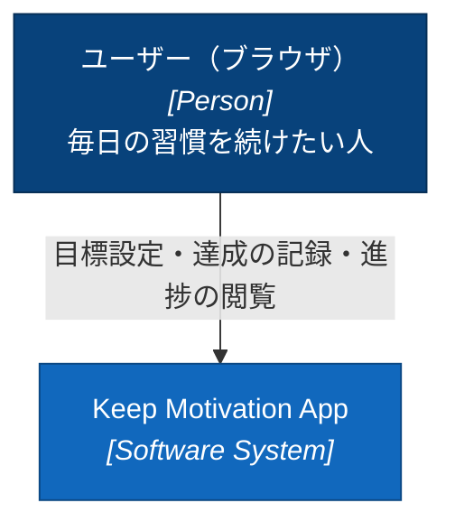
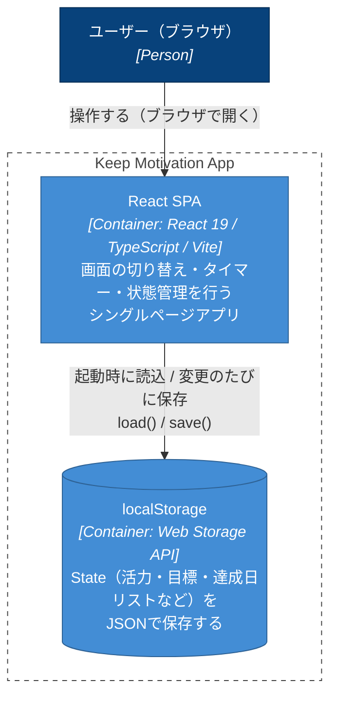
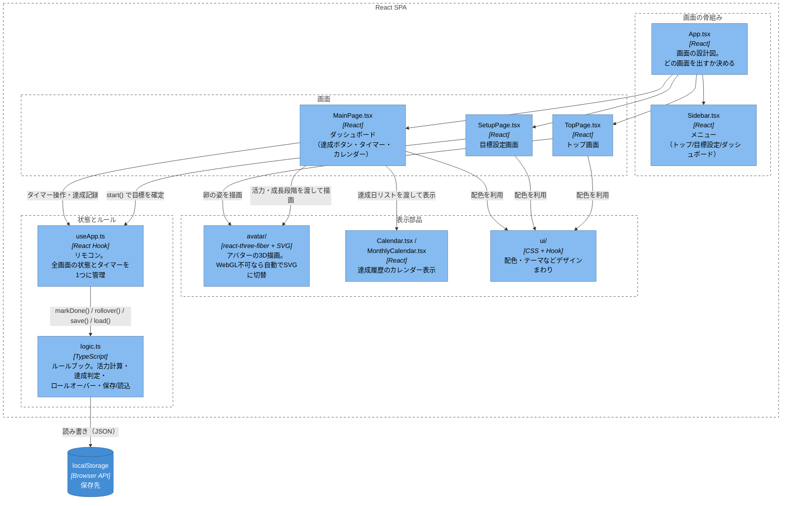
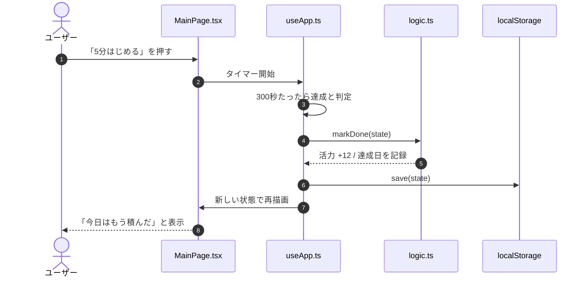
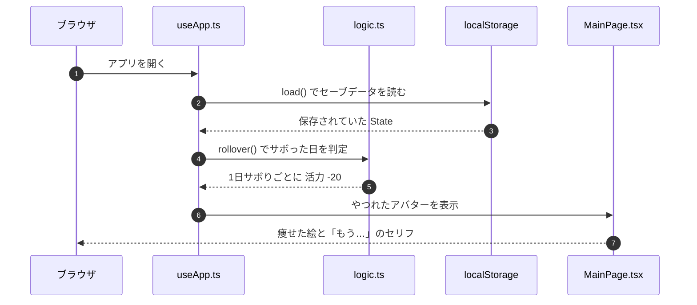

# アーキテクチャ図（C4モデル）

> このアプリの仕組みの見取り図です。用語の説明は
> [EXPLAIN.md](./EXPLAIN.md) にあります。このファイルの図は
> GitHub 上で Mermaid 図として自動表示されます。

---

## Level 1: System Context（誰が使うか）

ユーザーと、このアプリ（1個のシステムとして見た場合）の関係です。



- ユーザーが記録した状態（活力・目標・達成履歴）は、ブラウザの `localStorage` に残るだけで、外部に送信されることはありません。

---

## Level 2: Container（何が動いているか）

「システム」の中身を、実行される単位（コンテナ）に分解した図です。
このアプリはコンテナが2つしかない、非常にミニマルな構成です。



- `Vite` はビルド時にだけ使うツールで、実行時のコンテナではないため図には含めていません（`npm run dev` / `build` で SPA を組み立てます）。
- 3D 描画（three.js / react-three-fiber）は独立したコンテナではなく、SPA の中の一部品（Component レベル）として動きます。

---

## Level 3: Component（SPAの中身）

`React SPA` コンテナをさらに分解した図です。「誰が」「どのファイル」を
使って動いているかのつながりに対応します。



読み方のポイント:

- **`App.tsx`** は画面遷移だけを担当し、状態そのものは持ちません。
- **`useApp.ts`** が唯一の「状態のリモコン」。タイマーの秒数・実行中かどうか・
  どの画面を出すかをここで管理し、`logic.ts` の関数を呼んで状態を更新します。
- **`logic.ts`** は純粋なルール（活力の増減、サボり判定、日付計算）と
  `localStorage` の読み書きを担当する、UIを持たない層です。
- **`avatar/`** は WebGL が使えれば3D、使えなければ自動でインラインSVGに
  フォールバックします（`Avatar.tsx` 内の `WebGLBoundary` が担当）。

---

## 動的view: 主要な操作の流れ

C4の Context/Container/Component は「静的な構造」を表す図でした。
ここからは「時間の流れ」を示す動的な図（Dynamic Diagram）です。

### 1日のデータの流れ（達成ボタン）

ダッシュボードで「5分はじめる」を 5 分続けたときの流れです。



### アプリを開いたときのデータの流れ（やつれ判定）

「サボるとやつれる」を実現しているのは、アプリを開いたときに
`logic.ts` の `rollover()` が行う計算です。



---

---

## データモデル（保存される内容）

`logic.ts` の `State` が持つデータです。`localStorage` に JSON として
1件だけ書き込まれます（ユーザーごとの分岐やIDはありません）。

| 項目 | 型 | 意味 | 例 |
|---|---|---|---|
| `vitality` | `number` | 活力（0〜100）。達成で +12、1日サボるごとに -20 | `64` |
| `goal` | `string` | 目標 | `"資格の勉強"` |
| `deadline` | `string` | 期限（`YYYY-MM-DD`）。過ぎると振り返り画面へ | `"2026-03-31"` |
| `frequency` | `Frequency` | 取り組む頻度（下表） | `"毎日"` |
| `avatarId` | `number` | アバターの種類 | `0` |
| `name` | `string` | アバターの名前 | `"もりお"` |
| `done` | `string[]` | 達成日のリスト（`YYYY-MM-DD` の配列） | `["2026-03-01", ...]` |
| `best` | `number` | 最長記録（いちばん長く続いた連続日数） | `12` |

**`avatarId` の対応**： `0` = もりお / `1` = だいち / `2` = こむぎ

**`frequency` に入る値**： `毎日` / `週3回` / `週1回` / `決めてない`

### 保存されている JSON の例

```json
{
  "vitality": 64,
  "goal": "資格の勉強",
  "deadline": "2026-03-31",
  "frequency": "毎日",
  "avatarId": 0,
  "name": "もりお",
  "done": ["2026-03-01", "2026-03-02", "2026-03-04"],
  "best": 12
}
```

> `done` と `vitality` だけが日々更新され、残りは目標設定時に決まります。
> サボり判定（`rollover()`）は `done` の最終日と今日の差分から計算されます。