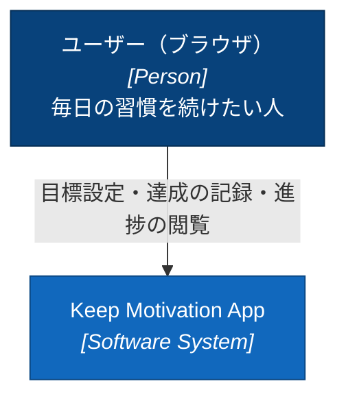
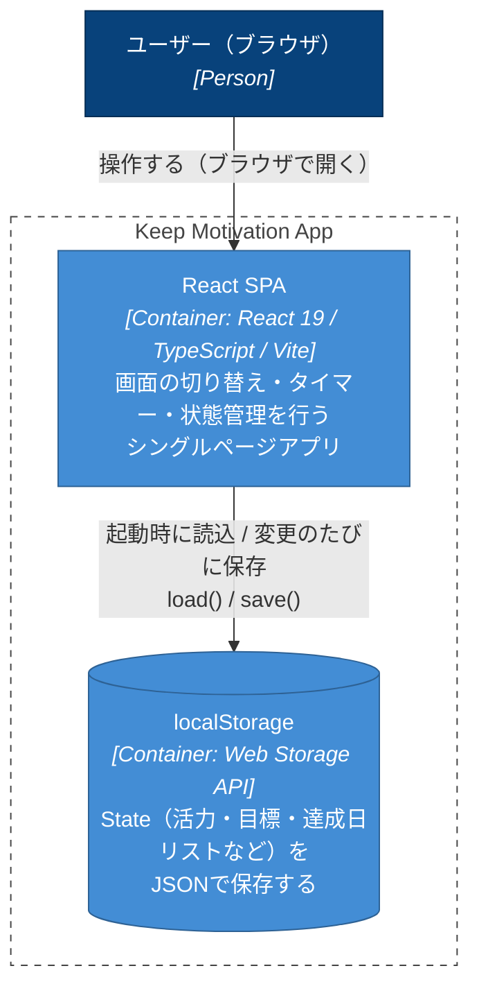
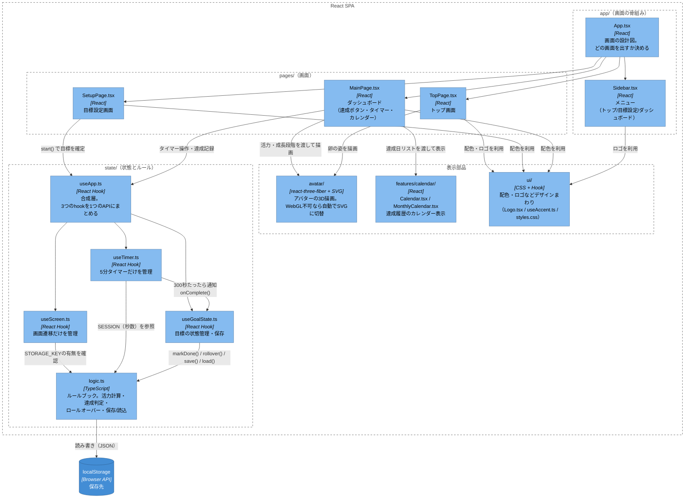
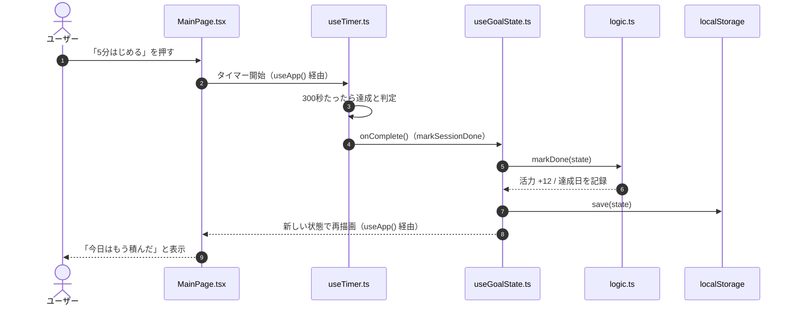
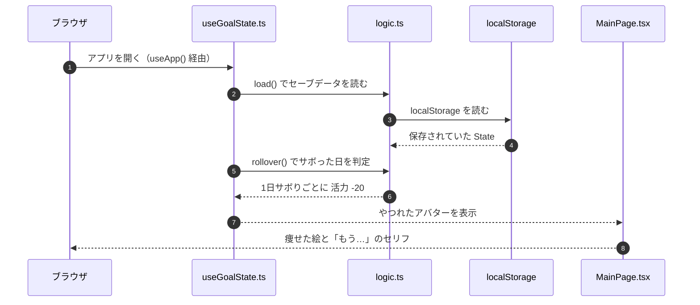

# アーキテクチャ図（C4モデル）

> このアプリの仕組みの見取り図です。用語の説明は
> [EXPLAIN.md](./EXPLAIN.md) にあります。このファイルの図は
> GitHub 上で Mermaid 図として自動表示されます。

---

## Level 1: System Context（誰が使うか）

ユーザーと、このアプリ（1個のシステムとして見た場合）の関係です。



- ユーザーが記録した状態（活力・目標・達成履歴）は、ブラウザの `localStorage` に残るだけで、外部に送信されることはありません。

---

## Level 2: Container（何が動いているか）

「システム」の中身を、実行される単位（コンテナ）に分解した図です。
このアプリはコンテナが2つしかない、非常にミニマルな構成です。



- `Vite` はビルド時にだけ使うツールで、実行時のコンテナではないため図には含めていません（`npm run dev` / `build` で SPA を組み立てます）。
- 3D 描画（three.js / react-three-fiber）は独立したコンテナではなく、SPA の中の一部品（Component レベル）として動きます。

---

## Level 3: Component（SPAの中身）

`React SPA` コンテナをさらに分解した図です。「誰が」「どのファイル」を
使って動いているかのつながりに対応します。フォルダ構成は機能単位
（`app/` `pages/` `features/` `state/` `avatar/` `ui/`）で揃えています。

### ディレクトリツリー

```text
src/
├── main.tsx                    エントリポイント。App を描画する
├── vite-env.d.ts                Vite の型定義
│
├── app/                          画面の骨組み
│   ├── App.tsx                    画面の設計図。どの画面を出すか決める
│   └── Sidebar.tsx                 メニュー（トップ/目標設定/ダッシュボード）
│
├── pages/                        画面（1画面 = 1ファイル）
│   ├── TopPage.tsx                 トップ画面
│   ├── SetupPage.tsx               目標設定画面
│   ├── MainPage.tsx                ダッシュボード（達成ボタン・タイマー・カレンダー）
│   └── main-page.css               MainPage 専用スタイル
│
├── features/
│   └── calendar/                  カレンダー機能一式
│       ├── Calendar.tsx             週表示（達成率・連続日数の集計もここ）
│       ├── MonthlyCalendar.tsx      月表示（Calendar.tsx から呼ばれる）
│       └── calendar.css             ↑2つのスタイル
│
├── state/                        状態とルール
│   ├── useApp.ts                   合成層。3つのhookを1つのAPIにまとめる
│   ├── useScreen.ts                画面遷移だけを管理
│   ├── useTimer.ts                 5分タイマーだけを管理
│   ├── useGoalState.ts             目標の状態管理・保存（localStorage）
│   └── logic.ts                    ルールブック。活力計算・達成判定・保存/読込
│
├── avatar/                        アバターの3D描画（react-three-fiber）
│   ├── Avatar.tsx                   入口。3D/SVGの切り替え（WebGL不可なら自動フォールバック）
│   ├── AvatarCanvas.tsx             three.js のカメラ・光源
│   ├── Chick.tsx                    3Dモデルの組み立て
│   ├── AvatarSvg.tsx                3D不可時に出す従来のSVG
│   ├── look.ts                      ステージ×活力 → 見た目パラメータの対応表
│   ├── stage.ts                     のべ達成日数 → 成長ステージ
│   ├── avatar.css                   表示サイズ
│   └── README.md                    このフォルダだけの詳しい説明書
│
└── ui/                            見た目の共通部品
    ├── Logo.tsx                     ロゴ
    ├── useAccent.ts                 活力レベル → アクセントカラーに反映
    └── styles.css                   全体スタイル（変数・共通クラスなど）
```



読み方のポイント:

- **`App.tsx`**（`app/`）は画面遷移だけを担当し、状態そのものは持ちません。
- **`useApp.ts`**（`state/`）は唯一の「状態のリモコン」だが、中身は3つの
  hookの合成層になっている。
  - **`useScreen.ts`**：どの画面を出すか（`screen`）だけを管理する。
  - **`useTimer.ts`**：5分タイマーの秒数・実行中かどうかだけを管理し、
    300秒たったら `useGoalState` の達成処理を呼ぶ（`onComplete`）。
  - **`useGoalState.ts`**：目標の状態（活力・達成履歴など）の管理と、
    `localStorage` への保存タイミングを担当する。
  - 3つは変化する理由がそれぞれ別（画面が増える／タイマー仕様が変わる／
    保存先が変わる）なので分けている。`useApp()` が返すAPI自体は分割前と
    同じなので、呼び出し側（`App.tsx`）はこの分割を意識しなくてよい。
- **`logic.ts`**（`state/`）は純粋なルール（活力の増減、サボり判定、日付計算）と
  `localStorage` の読み書きを担当する、UIを持たない層。`useScreen.ts`
  `useTimer.ts` `useGoalState.ts` はいずれもここの定数・関数を呼ぶだけで、
  ロジックそのものは持たない。
- **`avatar/`** は WebGL が使えれば3D、使えなければ自動でインラインSVGに
  フォールバックします（`Avatar.tsx` 内の `WebGLBoundary` が担当）。
- **`features/calendar/`** はカレンダー機能（週表示・月表示・専用CSS）を
  1フォルダにまとめたもの。同じ考え方で機能が増えたら `features/` 配下に
  フォルダを足していく想定。

---

## 動的view: 主要な操作の流れ

C4の Context/Container/Component は「静的な構造」を表す図でした。
ここからは「時間の流れ」を示す動的な図（Dynamic Diagram）です。

### 1日のデータの流れ（達成ボタン）

ダッシュボードで「5分はじめる」を 5 分続けたときの流れです。



（`useApp.ts` はこの一連の呼び出しを配線する合成層で、図では省略しています。）

### アプリを開いたときのデータの流れ（やつれ判定）

「サボるとやつれる」を実現しているのは、アプリを開いたときに
`logic.ts` の `rollover()` が行う計算です。



---

---

## データモデル（保存される内容）

`logic.ts` の `State` が持つデータです。`localStorage` に JSON として
1件だけ書き込まれます（ユーザーごとの分岐やIDはありません）。

| 項目 | 型 | 意味 | 例 |
|---|---|---|---|
| `vitality` | `number` | 活力（0〜100）。達成で +12、1日サボるごとに -20 | `64` |
| `goal` | `string` | 目標 | `"資格の勉強"` |
| `deadline` | `string` | 期限（`YYYY-MM-DD`）。過ぎると振り返り画面へ | `"2026-03-31"` |
| `frequency` | `Frequency` | 取り組む頻度（下表） | `"毎日"` |
| `avatarId` | `number` | アバターの種類 | `0` |
| `name` | `string` | アバターの名前 | `"もりお"` |
| `done` | `string[]` | 達成日のリスト（`YYYY-MM-DD` の配列） | `["2026-03-01", ...]` |
| `best` | `number` | 最長記録（いちばん長く続いた連続日数） | `12` |

**`avatarId` の対応**： `0` = もりお / `1` = だいち / `2` = こむぎ

**`frequency` に入る値**： `毎日` / `週3回` / `週1回` / `決めてない`

### 保存されている JSON の例

```json
{
  "vitality": 64,
  "goal": "資格の勉強",
  "deadline": "2026-03-31",
  "frequency": "毎日",
  "avatarId": 0,
  "name": "もりお",
  "done": ["2026-03-01", "2026-03-02", "2026-03-04"],
  "best": 12
}
```

> `done` と `vitality` だけが日々更新され、残りは目標設定時に決まります。
> サボり判定（`rollover()`）は `done` の最終日と今日の差分から計算されます。