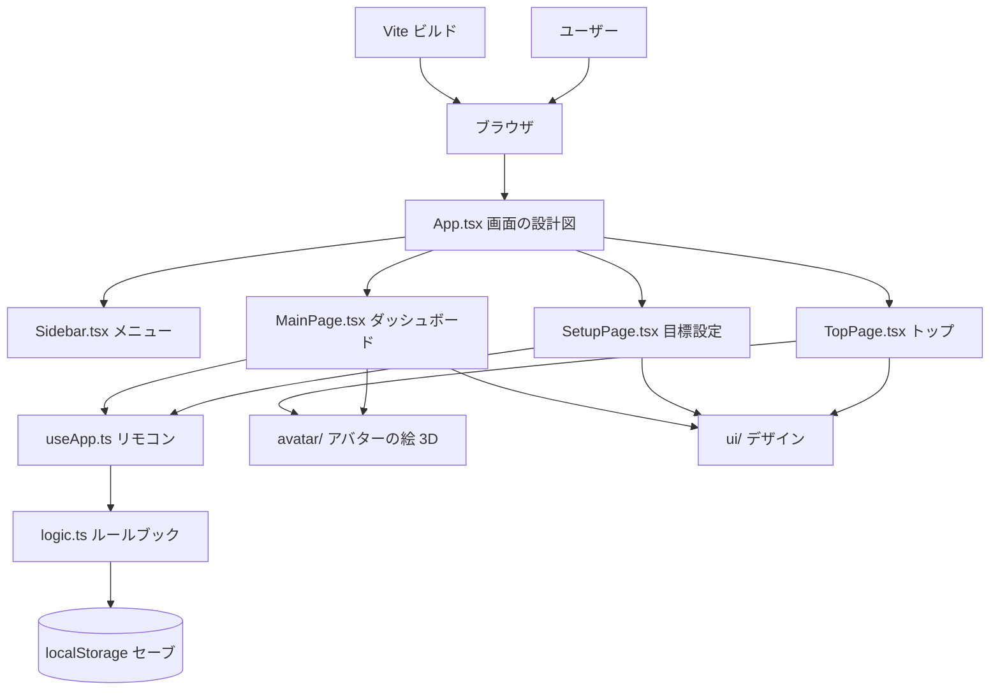
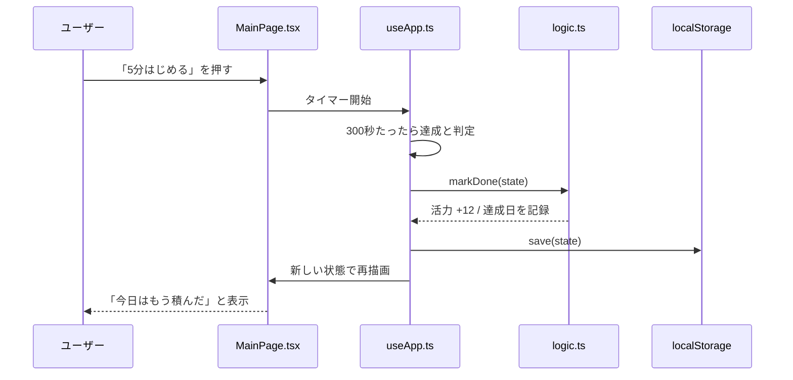
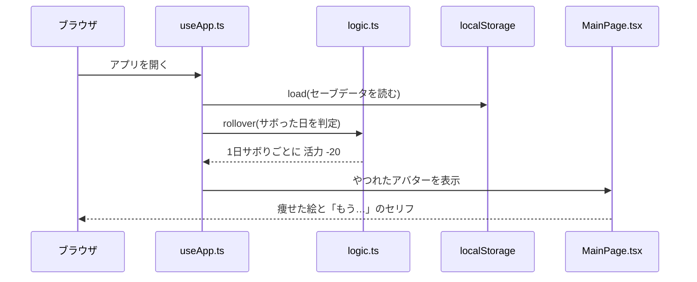

# アーキテクチャ図

> このアプリの仕組みの見取り図です。用語の説明は
> [EXPLAIN.md](./EXPLAIN.md) にあります。このファイルの図は
> GitHub 上で Mermaid 図として自動表示されます。

---

## 1. 全体構成

「誰が」「どのファイル」を使って動いているかのつながりです。



- `App.tsx` が「どの画面を出すか」を決める設計図
- `useApp.ts` がリモコンとなり、全画面の状態を1つに管理
- `logic.ts` がルールを計算し、`localStorage` が記録を保存
- `pages/` と `avatar/` と `ui/` が画面と絵とデザインを担当

---

## 2. 1日のデータの流れ（達成ボタン）

ダッシュボードで「5分はじめる」を 5 分続けたときの流れです。



---

## 3. アプリを開いたときのデータの流れ（やつれ判定）

「サボるとやつれる」を実現しているのは、アプリを開いたときに
`logic.ts` の `rollover()` が行う計算です。



---

## 4. 記録の持ち方（データモデル）

`logic.ts` の `State` が持つデータのイメージです。保存形式は
`localStorage` に JSON として書き込まれます。

```text
State {
  活力 (vitality)     0〜100 の数字
  目標 (goal)         文字列。例「資格の勉強」
  期限 (deadline)     YYYY-MM-DD。過ぎると振り返り画面
  頻度 (frequency)    毎日 / 週3回 / 週1回 / 決めてない
  アバター種 (avatarId) 0=もりお 1=だいち 2=こむぎ
  名前 (name)         アバターの名前
  達成日リスト (done)  やった日の日付の一覧
  最長記録 (best)      いちばん長く続いた連続日数
}
```
