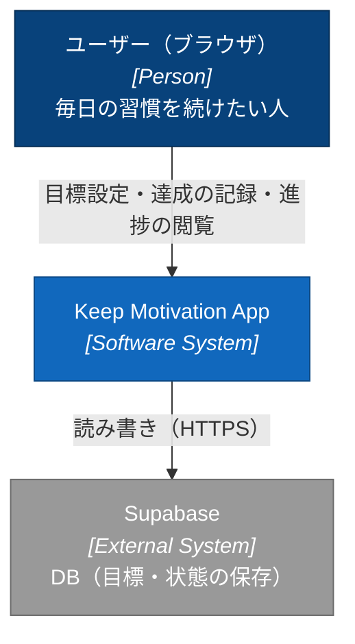
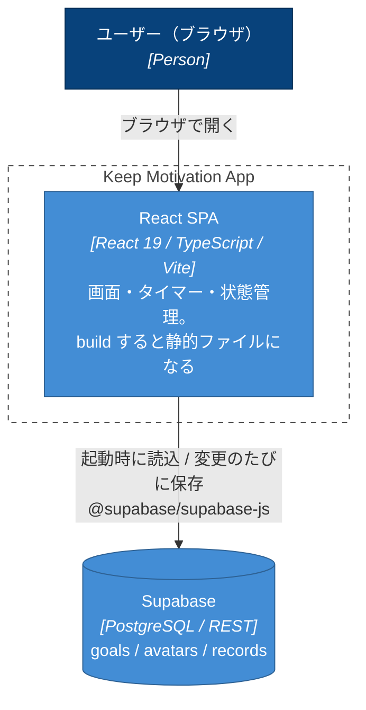
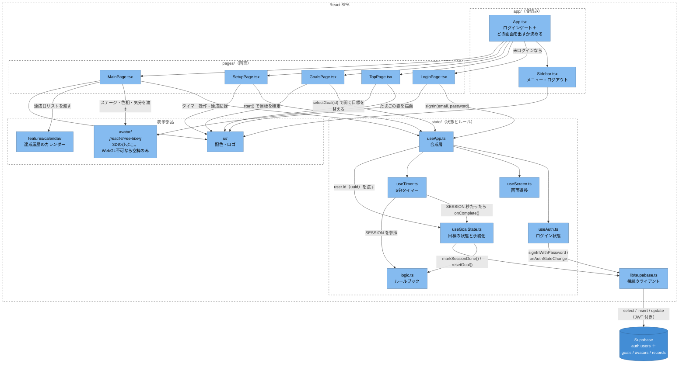
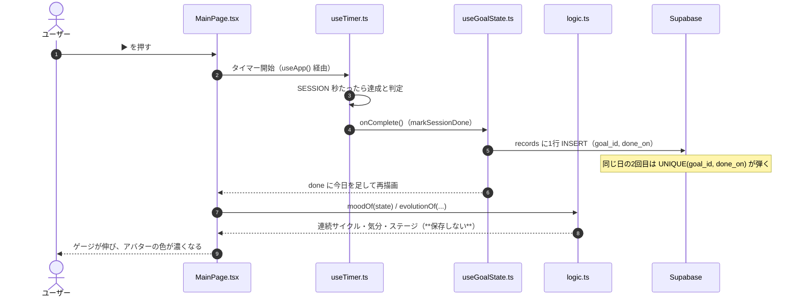
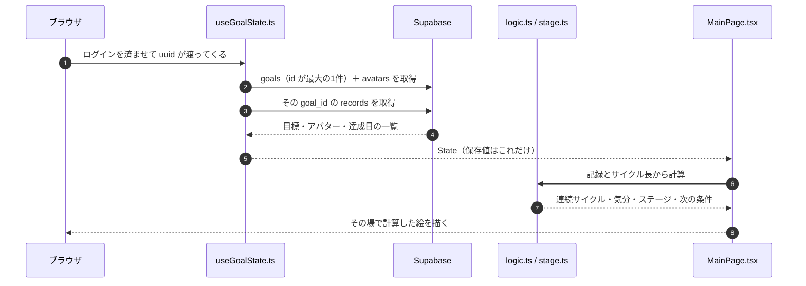
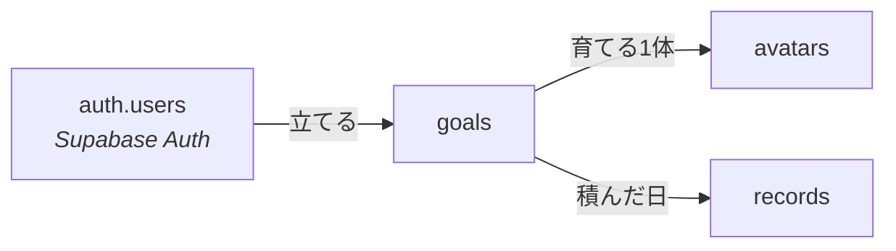

# アーキテクチャ — 何がどう動いているか

このアプリの見取り図。**構成・データの持ち方・既知の課題・置き場所**をまとめています。
アプリの機能と動かし方は [README.md](./README.md)、分担とルールは [TEAM.md](./TEAM.md) を参照。

> ゲームのルールの数値（`MOODS` / `STAGES` / `SESSION`）はここには書きません。
> 原典は `src/state/logic.ts` と `src/avatar/stage.ts`、読み物としては
> [README 2章](./README.md#2-ゲームのルール)にあります。
> 図は GitHub 上で Mermaid として自動表示されます。

---

## 1. 全体像

### 誰が使うか（C4: System Context）



### 何が動いているか（C4: Container）



- **自前のバックエンドはありません。** `npm run build` すると HTML / JS / CSS になるだけで、
  常駐するサーバープロセスがありません。DB アクセスは Supabase が直接受けます
- `Vite` はビルド時だけの道具なので、実行時のコンテナとしては描いていません
- 3D 描画（three.js）は独立したコンテナではなく、SPA の中の一部品です

---

## 2. `src/` の構造

```text
src/
├── main.tsx                    エントリポイント。App を描画する
├── vite-env.d.ts               Vite の型定義
│
├── app/                        画面の骨組み
│   ├── App.tsx                   どの画面を出すか決める。状態は持たない
│   └── Sidebar.tsx               メニュー（トップ/目標一覧/ダッシュボード）＋ 表示名・ログアウト
│
├── pages/                      画面（1画面 = 1ファイル）
│   ├── LoginPage.tsx             ログイン（メールアドレス＋パスワード）
│   ├── TopPage.tsx               トップ
│   ├── GoalsPage.tsx             目標一覧（どの目標を開くか選ぶ）
│   ├── SetupPage.tsx             目標設定（新しい目標を作る。メニューには出さない）
│   ├── MainPage.tsx              ダッシュボード
│   ├── DebugPage.tsx             デバッグ（開発時だけ。`/debugPage`）
│   ├── main-page.css
│   ├── goals-page.css
│   ├── debug-page.css
│   └── onboarding-page.css
│
├── features/
│   └── calendar/               カレンダー機能一式
│       ├── Calendar.tsx          週表示（達成率・連続サイクルの集計もここ）
│       ├── MonthlyCalendar.tsx   月表示（Calendar.tsx から呼ばれる）
│       └── calendar.css
│
├── state/                      状態とルール
│   ├── useApp.ts                 合成層。下の4つを1つのAPIにまとめる
│   ├── useAuth.ts                ログイン状態だけ。DB を知らない
│   ├── useScreen.ts              画面遷移だけ
│   ├── useTimer.ts               5分タイマーだけ
│   ├── useGoalState.ts           目標の状態管理と Supabase の読み書き
│   ├── debug.ts                  **消す**操作。DebugPage だけが import する
│   └── logic.ts                  ルールブック。サイクル・連続・気分・日付計算
│
├── lib/
│   └── supabase.ts             DB の接続クライアント
│
├── avatar/                     アバターの3D描画 → src/avatar/README.md に詳細
│   ├── Avatar.tsx / AvatarCanvas.tsx / Chick.tsx
│   ├── look.ts / stage.ts / avatar.css
│   ├── models/                   chick.blend / chick.glb / export_glb.py
│   └── docs/                     Blender の作業メモ
│
└── ui/                         見た目の共通部品
    ├── Logo.tsx / useAccent.ts / styles.css
```

### つながり（C4: Component）



読み方のポイント:

- **`App.tsx` は画面遷移とログインゲートだけ**を担当し、状態そのものは持ちません。
  ゲートは3段で、`!ready`（セッション確認中）→ `!user`（ログイン画面）→ `!loaded`（目標の読み込み中）の順
- **`useApp.ts` は唯一の「状態のリモコン」**ですが、中身は4つの hook の合成層です。
  分けている理由は**変化する理由が別々**だから（画面が増える／タイマー仕様が変わる／保存先が変わる）。
  `useApp()` が返す API は分割前と同じなので、呼び出し側はこの分割を意識しなくて済みます
- **`logic.ts` は UI を持たない純粋なルール**（サイクルの数え方、気分の表、日付計算）。
  4つの hook はここの定数・関数を呼ぶだけで、ロジックそのものは持ちません
- **`useAuth.ts` は DB を知らず、`useGoalState.ts` は誰がログインしているかを知りません。**
  間をつなぐのは `useApp.ts` が渡す uuid 1つだけです。第2段階で Google ログインに変えるとき、
  差し替わるのは `useAuth.ts` の `signIn` と `LoginPage.tsx` の入力欄だけで済みます
- **`avatar/` の見た目は3Dの一種類だけ**です。WebGL が使えない／初期化に失敗した場合は、
  レイアウトを保つための空枠だけが残ります（`Avatar.tsx` の `WebGLBoundary`）
- **`features/calendar/`** は機能ひとまとまりの置き場。機能が増えたら `features/` にフォルダを足します

---

## 3. データの流れ

### 5分やりきったとき



（`useApp.ts` はこの呼び出しを配線する合成層で、図では省略しています。
「記録だけつける」ボタンは、タイマーを飛ばして `markSessionDone` を直接呼ぶ同じ流れです。）

### アプリを開いたとき



**やつれ判定のような「起動時の後処理」はもうありません。** 保存値が記録だけなので、
いつ開いても同じ計算結果になります（以前は活力を保存していて、読み込みのタイミングでズレました）。

---

## 4. データモデル

接続クライアントは [`src/lib/supabase.ts`](./src/lib/supabase.ts)、読み書きは
[`src/state/useGoalState.ts`](./src/state/useGoalState.ts) に閉じています。
環境変数は [`.env.example`](./.env.example) を参照。



**DDL の原典は [`supabase/schema.sql`](./supabase/schema.sql)** です（新しいプロジェクトに
1本流すだけで、この形になります）。以下はその要約。

### `auth.users` — 持ち主（Supabase Auth）

**`public` に自前の `users` テーブルは置いていません。** 持ち主は Supabase Auth が管理する
`auth.users` で、パスワードのハッシュ（`encrypted_password`）も照合も Supabase の中で完結します。
自前で持つと anon key で全員分のハッシュが読めてしまい、`auth.uid()` が無いので RLS も書けません。

表示名は JWT（`user_metadata.name`、無ければ `email`）から取ります。
**登録画面はありません。** アカウントは Supabase の管理画面 Authentication → Users で手作業で配ります
（新規登録も管理画面で無効にしてあります）。

### `goals` — 目標

| カラム | 型 | 内容 |
| --- | --- | --- |
| `id` | `bigserial` PK | 目標ID |
| `user_id` | `uuid` FK | どのユーザーのものか（`auth.users(id)`、`ON DELETE CASCADE`） |
| `goal` | `text` | 目標の文章 |
| `deadline` | `date` | 期限 |
| `cycle_days` | `int` | サイクル長。「n日に1回」の n |
| `started_at` | `date` | サイクルの起点（目標を作った日） |

**目標は同時に何本あってもかまいません。** 現役を示す列は持ちません。
目標ごとにアバターと記録がぶら下がるので、行が並んでいればそれだけで並行になります。
**どれを開いているかは DB の関心事ではない**ので、画面側（`useGoalState` の `currentId`）が持ち、
目標一覧（`pages/GoalsPage.tsx`）で選び替えます。切り替えても記録もアバターも消えません。

> **「現役の目標」を列で持たないのは意図的です。** 印を1本だけ立てる形にすると、
> 「立っている印は1件だけ」を DB が保証できず（部分ユニークインデックスが別途要る）、
> 印を移す UPDATE と新しい目標の INSERT もトランザクションではないので、
> 途中で失敗すると現役が0件にも2件にもなりえます。
> 並行に持てるなら、そもそも現役を1本に決める必要がありません。

### `avatars` — 育てる1体（目標と 1:1）

| カラム | 型 | 内容 |
| --- | --- | --- |
| `goal_id` | `bigint` FK UNIQUE | 1目標に1体 |
| `name` | `text` | アバターの名前 |
| `hue` | `int` | 色相 0〜359。ユーザーが選ぶ |
| `seen_stage` | `int` | **進化の演出をどこまで見せたか。唯一の「計算できない保存値」** |

### `records` — 積んだ日

| カラム | 型 | 内容 |
| --- | --- | --- |
| `goal_id` | `bigint` FK | どの目標の記録か |
| `done_on` | `date` | 達成した日。`UNIQUE (goal_id, done_on)` が同日の重複を弾く |
| `minutes` | `int` | 何分やったか（1日1行なので最初のセッションぶん） |

### 読み書きの対応

| 操作 | DBへの処理 |
| --- | --- |
| 起動 | `goals`（`id` が最大の1件）に `avatars` を join して取得 ＋ その `records` |
| 目標作成 | `goals` に INSERT（`started_at = 今日`）→ 返った `id` で `avatars` に INSERT |
| 1日達成 | `records` に **INSERT 1行**（同日は UNIQUE が弾く） |
| 進化の演出を流し終わった | `avatars.seen_stage` を UPDATE |
| 期限延長 | `goals.deadline` を UPDATE |
| 目標の作り直し | 新しい `goals` ＋ `avatars` を INSERT するだけ。**前の目標には触らない**（記録もアバターも残る） |
| 画面を描くとき | **なし**（`records` と `cycle_days` / `started_at` から毎回その場で計算） |

**本番の画面から行が減ることはありません。** 記録も目標も増えるだけです。
DELETE はデバッグ画面にしかありません。

### デバッグ画面（開発時だけ）

`npm run dev` 中に `/debugPage` を開くと出ます。`import.meta.env.DEV` で
遅延読み込みしているので（`app/App.tsx`）、**本番のバンドルには入りません**。

デバッグが操作するのは**2つだけ**です。気分もステージも `cycleIndex()` でサイクル番号に
直してからしか判定していないので（`state/logic.ts` / `avatar/stage.ts`）、
**日付と記録さえ動かせれば、気分7段もステージ4段も全部再現できます。**

| 軸 | 何を動かすか | DB |
| --- | --- | --- |
| 日付 | `dayOffset`（±1日 / ±1サイクル / 日付を直接指定 / 今日に戻す） | 触らない |
| 記録 | `records` の1行＝1日を、つける / 消す | 書く |

**目標の一覧もここにしかありません。** アプリ本体は `id` が最大の1件しか読まないので、
たまっている過去の目標は他のどこからも見えません。

`dayOffset` は**負の値も入ります**。行き過ぎた日送りを戻せないと、やり直しがききません。
日付を戻しても計算は壊れません（`lastDoneCycle()` が今より先のサイクルを数えないため）。

DELETE 系は `state/debug.ts` に隔離してあります。`useGoalState` に置くと
「押せてしまう導線」が本番の画面に生まれるためです。

| 操作 | DBへの処理 |
| --- | --- |
| 1日ぶんの記録を消す | `records` から `(goal_id, done_on)` で DELETE |
| 記録を全部消す | `records` から `goal_id` で DELETE（目標とアバターは残る＝たまごに戻る） |
| 目標を消す | `records` → `avatars` → `goals` の順に DELETE |
| 全部の目標を消す | 過去のぶんも含めて、上を全件ぶん繰り返す |
| 演出の見せ済みを戻す | `avatars.seen_stage` を UPDATE（**下げる**） |

- **子から先に消します。** `records.goal_id` と `avatars.goal_id` に `ON DELETE CASCADE` が
  無いので（`supabase/schema.sql`）、親から消すと外部キー違反で落ちます
- 消したあとは必ず DB から読み直します（`useGoalState` の `reload`）。画面の値を手で
  合わせると「消えたつもりで消えていない」を見逃します
- **進化の演出は `ステージ > avatars.seen_stage` の間しか流れません**（`pages/MainPage.tsx`）。
  流し終わると `seen_stage` が上がるので、もう一度見るには戻すしかありません

### RLS（行レベルセキュリティ）

anon key はブラウザに配られるので、**誰が何を読めるかを決めているのは RLS だけ**です。
3テーブルとも有効にしてあり、ポリシーの形は2つしかありません。

| テーブル | ポリシー | 条件 |
| --- | --- | --- |
| `goals` | `goals_own` | `auth.uid() = user_id` |
| `avatars` | `avatars_own` | 親の `goals` が自分のものか（`EXISTS`） |
| `records` | `records_own` | 同上 |

`FOR ALL` なので SELECT / INSERT / UPDATE / DELETE の全部に効きます。`USING` が既にある行、
`WITH CHECK` が書こうとしている行の条件で、他人の `goal_id` を書き込まれないよう両方に同じ条件を置いています。

JWT は `supabase.from(...)` に自動で付くので、アプリ側に `Authorization` を書く場所はありません。
`useGoalState.ts` に残っている `.eq('user_id', ...)` はもう防御ではなく、自分の目標だけを引く絞り込みです。

### DBに保存していないもの

**連続サイクル数・気分・ステージ・最長記録は保存しません。** 記録から計算できるからです。

| 項目 | 用途 | 再読み込み時 |
| --- | --- | --- |
| `dayOffset` | デバッグ用の日送り | `0` に戻る |
| `loaded` / `hasStarted` | 読み込み・開始状況 | hook 内で再設定 |
| 画面・タイマーの状態 | 現在の画面、経過秒数 | 保存していない |

---

## 5. 既知の制約・課題

**データまわり**

- **アカウントは管理画面で手作業で配ります。** 登録画面もパスワード再発行の導線もありません
  （3人で使う前提。詳細は [`AUTH_PLAN.md`](./AUTH_PLAN.md)）
- **ペース（`cycle_days`）はあとから変えられません。** 変えると過去の記録の所属サイクルが
  変わるため、「過去を切り直さずに変える」には変更履歴のテーブルが要ります。いまは
  「変えたいなら新しい目標＝たまごから」。**1日に1回にした人の逃げ道が作り直しだけ**なのが
  未解決の宿題です
- 目標作成は `goals` → `avatars` の2回の INSERT で、**トランザクションではありません。**
  片方だけ成功する余地が残っています（失敗時は Console にエラー）。
  `goals` だけ入ると、アバターの無い目標が目標一覧に並びます
- **目標は増える一方で、古いものを片付ける導線がありません。** 作るたびに `goals` が
  1行ずつ積まれ、**全部が目標一覧に並び続けます**。並行に持てるようになったぶん、
  終わった目標を畳む導線（並べ替え・非表示）が要るのはこれからの宿題です
- **どの目標を開いているかは端末ごとです。** `localStorage` に置いているので、
  別の端末やプライベートウィンドウで開くと、いちばん新しい目標から始まります

**コードまわり**

- **テストはルールの純粋関数だけです**（`npm test`）。`logic.ts` / `stage.ts` のサイクル計算・
  気分・進化条件は覆っていますが、画面とDBの読み書きは手で確かめています
- **lint / format 設定がありません。** いまスタイルが揃っているのは「守られている」のではなく
  「たまたま揃っている」状態です

> 着手の担当と順番は [TEAM 3章「足回り」](./TEAM.md#3-いまのタスク)。ここは**何が問題か**だけを書き、
> **誰がいつやるか**は TEAM.md に置いています。

---

## 6. どこに置くか（デプロイ）

企画時点の想定は「React + Supabase + Google Cloud Run」でしたが、
**Cloud Run はやめて静的ホスティングにする**方針です。

```text
ブラウザ ──▶ 静的ホスティング（HTML/JS/CSS を配るだけ）
   │
   └──────▶ Supabase（DB / 認証 / API）
```

### なぜ Cloud Run ではないか

Cloud Run は**常駐するサーバープロセス**を動かす場所です。このアプリのフロントは
`build` すればただの静的ファイルで、動かすものがありません。DB も認証も Supabase が
受けるので、間に立つサーバーが不要です。

| | 静的ホスティング | Cloud Run |
| --- | --- | --- |
| 必要な作業 | `build` して `deploy` の2コマンド | Dockerfile、Artifact Registry、IAM など |
| 費用 | 無料枠で足りる | 従量課金（要クレカ登録） |
| 速度 | CDN から即配信 | コールドスタートあり |
| このアプリでの利点 | — | **無し** |

**Cloud Run が要るのは**、Supabase では書けない処理（外部APIの鍵を隠して叩く、重いバッチ、
定期通知）が出てきた時です。その多くは Supabase Edge Functions で足ります。**今は入れない。**

### 公開の手順（着手時）

- [ ] RLS（行レベルセキュリティ）を有効にする ← **他人のデータが読めてしまう事故を防ぐ。必須**
- [ ] `npm i -g firebase-tools` → `firebase login` → `firebase init hosting`
      （公開ディレクトリは `dist`、SPA 設定は「Yes」）
- [ ] `npm run build && firebase deploy` で公開できることを確認
- [ ] GitHub Actions で main マージ時に自動デプロイ（余裕が出てから）

> anon key はブラウザに露出する前提の鍵なので、漏れても RLS があれば守られます。
> **逆に言うと RLS が無いと全データが読み書きされます**（5章の1つ目の課題）。
> 1つ目のチェックを飛ばさないこと。

Firebase Hosting を選ぶ理由は、無料枠・CDN・HTTPS 自動・カスタムドメインが揃っていて
Google アカウントで完結するためです。Vercel / Cloudflare Pages / GitHub Pages でも問題なく、
**乗り換えは後からでも数十分でできます。**
