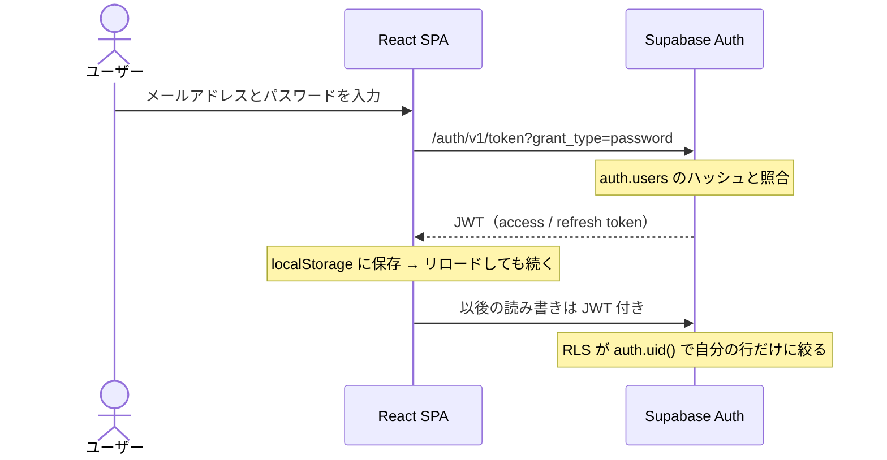
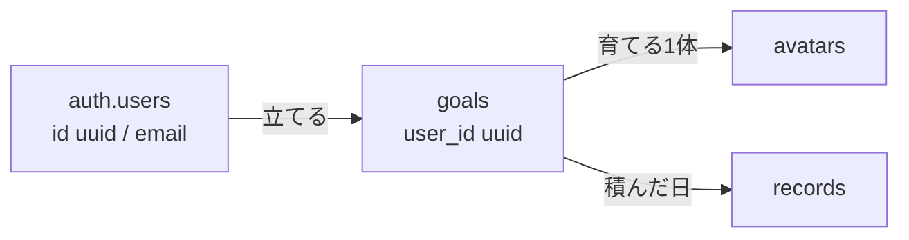
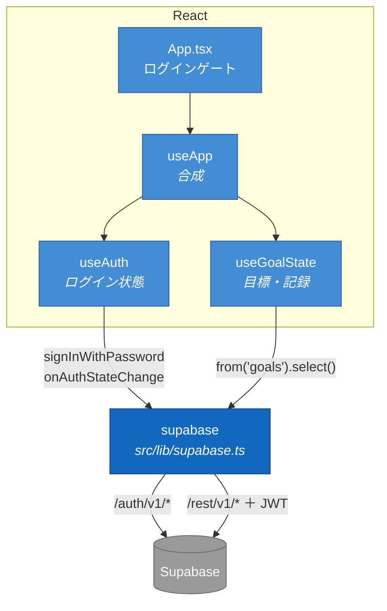
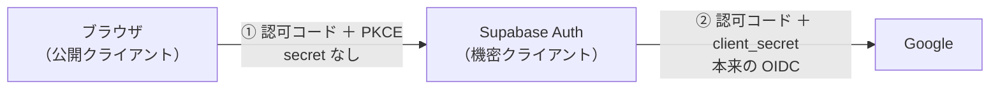
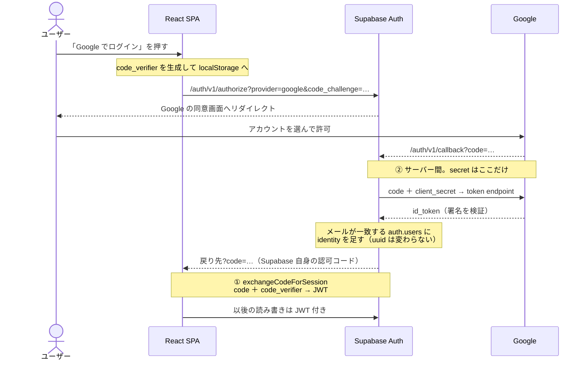

# ログイン機能の計画

- **第1段階**：メールアドレス＋パスワード（本編）
- **第2段階**：Google ログインに差し替え（7章・後日）

---

## 0. 進捗（2026-09-22 時点）

コードと DB は入りました。**残りは Supabase 管理画面の手作業と、それが済んでからの確認です。**

### 実装（5章 手順2）

- [x] `schema.sql` を書き換え（`users` 削除 / `goals.user_id` を uuid / RLS とポリシー）
- [x] 開発用の SQL Editor に流す → **MCP から `nzfdnurypyxlrdulvvlc` に適用済み**
      （新規プロジェクトは作らず、`.env` が既に指していたこのプロジェクトに流しました。
      旧データ goals 3 / avatars 3 / records 13 は消えています）
- [x] `useAuth.ts` 追加、`USER_ID` 削除
- [x] `LoginPage`・ログインゲート・ログアウト
- [x] ドキュメント更新（`ARCHITECTURE.md` / `README.md` / `TEAM.md`）

ブランチは `feature/password-login`、4コミット。`npm run build` と `npm test`（37件）は通っています。

### Supabase 管理画面（5章 手順1）← **いまここ。誰もログインできない状態**

`auth.users` は 0 件です。MCP からは触れないので手作業でお願いします。

- [ ] Authentication → Providers → **Email を有効 / Confirm email を OFF**
- [ ] Authentication → Providers → **Allow new users to sign up を OFF**
- [ ] Authentication → Users → **Add user** で3人分
      （本人の Gmail ／ **Auto Confirm User にチェック** ／ 仮パスワードを本人に渡す）
- [x] 手元の `.env`（URL / anon key は変更不要だった）

### 確認（5章 手順3）

- [x] パスワードを間違えるとエラーが出る（画面が固まらない）← ブラウザで確認済み
- [x] 未ログイン（anon key だけ）では `goals` が読めない・書けない
      （`select` は空、`insert` は `42501`。security advisor もクリーン）
- [ ] **2アカウントでログインし、互いのデータが見えない**（RLS。ここが本番）
- [ ] リロードしてもログインが続く
- [ ] ログアウトでログイン画面に戻る
- [ ] devtools から `supabase.auth.signUp(...)` を叩いても登録できない
- [ ] PR 本文に「**マージ時に共有プロジェクトのデータが消える**」と明記

### 着手前・切り替えの日（5章 手順0・4）

- [ ] 「認証と RLS を入れる。`users` は消す」と共有して反応をもらう
- [ ] 3人の Gmail アドレスを集める
- [ ] 切り替えの日を決める
- [ ] 手順4（共有プロジェクトの設定・スキーマ・マージ）

---

## 1. 方針

- 認証は **Supabase Auth の Email プロバイダ**に任せる
- パスワードは `auth.users.encrypted_password`（bcrypt）に入り、照合も Supabase 内で完結
- `public.users` に自前のパスワード列は**持たない**
  - anon key で全員分のハッシュが読める
  - `auth.uid()` が無いと RLS が書けない
- **登録画面は作らない**（3人固定 → 管理画面で手作業、新規登録は無効化）
- 作業の本体は認証方式ではなく **uuid 化と RLS**（3章）。第2段階でもそのまま残る

---

## 2. ログインの流れ

### ログイン ID は本人の Gmail アドレス

- Supabase はメールアドレス形式を要求 → ユーザー名は不可
- 架空のアドレスでも動くが、**本人の Gmail にする**
- 理由：第2段階で Google に移るとき、同じメールなら同じ `auth.users` 行に identity が足され、uuid とデータが引き継がれる。架空だと別行になりデータが孤児化する
- 確認メールは OFF なので、実際に届く必要はない

---

## 3. データモデル

| テーブル | 変更 | 理由 |
| --- | --- | --- |
| `users` | 削除 | `name` は未使用、FK の受け皿だけ。表示名は JWT から取る |
| `goals` | `user_id` を `uuid NOT NULL REFERENCES auth.users(id) ON DELETE CASCADE` | 持ち主を `auth.users` に移す |
| `avatars` / `records` | 変更なし | `goal_id` 経由で持ち主が決まる |

RLS は全テーブルで有効化。ポリシーは2形だけ。

- `goals` … `auth.uid() = user_id`
- `avatars` / `records` … `goal_id` の `goals` が自分のものか（`EXISTS`）

第2段階でもここは無変更。

---

## 4. React 側の構成

- クライアント1個（`src/lib/supabase.ts`）が認証と DB 両方の窓口
- ログイン後は `from('goals')` に **JWT が自動で付く** → `Authorization` を書く場所は無い
- 既存の `useApp` に `useAuth` を1本足すだけ

| 層 | 役割 |
| --- | --- |
| `useAuth` | ログイン状態だけ。DB を知らない |
| `useGoalState` | 目標・記録。uuid を1つ受け取るだけ |
| `useApp` | 2つを配線 |
| `App.tsx` | 未ログインなら `LoginPage` |

### 新規ファイル

**`src/state/useAuth.ts`** — 新しく要るのは実質これだけ。

- 状態は `user`（`User | null`）と `ready`（セッション確認が終わったか）の2つ
- マウント時に `getSession()` で復帰（リロードしてもログインが続くのはここ）
- `onAuthStateChange` でログイン・ログアウト・トークン更新をまとめて受け、アンマウントで `unsubscribe`
- 公開するのは `{ user, ready, signIn, signOut }`
- `signIn` は `signInWithPassword({ email, password })` を呼ぶだけ。**第2段階で差し替わるのはここだけ**

エラーの扱い：

- `signInWithPassword` は `{ data, error }` を返す（**throw しない**）
- パスワード違いは `error.message === 'Invalid login credentials'`
- 画面には「メールアドレスかパスワードが違います」と出す（どちらが違うかは言わない。アドレスの存在を当てられるため）

**`src/pages/LoginPage.tsx`** — 入力欄2つ・ボタン1つ・エラー表示。
`autoComplete="username"` / `"current-password"` を付ける。新規登録リンクは置かない。

### 既存ファイルの変更（4箇所）

| ファイル | やること |
| --- | --- |
| `src/state/useGoalState.ts` | `const USER_ID = 1` を削除し `userId: string \| null` を引数で受ける。読み込みを `userId` に依存させる。`goal_id` で絞る関数は無変更 |
| `src/state/useApp.ts` | `useAuth` を合成し `user.id` を渡す。ログアウトでタイマー・目標・画面も戻す |
| `src/app/App.tsx` | ゲートを1段追加：`!ready` → `!user` → `!loaded` → 本体 |
| `src/app/Sidebar.tsx` | 表示名（`user.user_metadata.name ?? user.email`）とログアウトボタン |

### 触らないもの

- `src/lib/supabase.ts`（JWT は自動で付く）
- `.env`（URL と anon key だけで足りる）
- `logic.ts` / `stage.ts` / `avatar/` / 各ページ → 既存テストはそのまま通る

分担は `state/` と `app/` `pages/` にまたがるので、**`useAuth` の返り値を先に決めてから**始める。

---

## 5. 手順

### 0. 着手前（全員・15分）

- [ ] 「認証と RLS を入れる。`users` は消す」と共有して反応をもらう
- [ ] 3人の **Gmail アドレス**を集める（2章）
- [ ] 切り替えの日（手順4）を決める。**共有プロジェクトのデータは全部消える**
- [ ] その間、他の2人は `supabase/schema.sql` と `useGoalState.ts` を触らない

GCP の作業は第2段階まで無し。

### 1. Supabase 開発用プロジェクト（担当1人・手作業）

- [ ] 新規プロジェクトを作る（無料枠）
- [ ] Authentication → Providers → **Email を有効 / Confirm email を OFF**
- [ ] Authentication → Providers → **Allow new users to sign up を OFF**（`signUp` がサーバー側で拒否される）
- [ ] Authentication → Users → **Add user** で3人分
      - メールアドレスは本人の Gmail
      - **Auto Confirm User にチェック**（無いとログインできない）
      - 仮パスワードを本人に渡す
- [ ] 手元の `.env` を開発用の URL / anon key に差し替える

コンソール作業はこれで全部。

### 2. 実装

`main` から `feature/password-login` を切り、1コミット = 1つのことで進める。

- `schema.sql` を書き換え、開発用の SQL Editor に流す
- `useAuth.ts` 追加、`USER_ID` 削除
- `LoginPage`・ログインゲート・ログアウト
- ドキュメント更新
  - `ARCHITECTURE.md`：データモデルから `users` を消す／「ユーザーの区別がありません」を削除
  - `README.md`：「ログインする」を追記（アカウントは管理画面で配る）
  - `TEAM.md`：認証と RLS にチェック
  - `AUTH_PLAN.md`：7章だけ残した形に削る

### 3. PR 前の確認

- [ ] **2アカウントでログインし、互いのデータが見えない**（RLS。ここが本番）
- [ ] リロードしてもログインが続く
- [ ] ログアウトでログイン画面に戻る
- [ ] パスワードを間違えるとエラーが出る（画面が固まらない）
- [ ] devtools から `supabase.auth.signUp(...)` を叩いても登録できない
- [ ] PR 本文に「**マージ時に共有プロジェクトのデータが消える**」と明記

### 4. 切り替えの日（全員・15分）

この順番で。

- [ ] 全員、作業中のものを push して手を止める
- [ ] 共有プロジェクトの Authentication を手順1と同じに設定し、3人のユーザーを作る
- [ ] 共有プロジェクトに新しい `schema.sql` を流す
- [ ] PR をマージ
- [ ] 全員、自分のアカウントでログインできることを確認

`.env` の差し替えは不要（共有プロジェクトの URL と anon key は変わらない）。データは消えているので目標を作り直すところから。

---

## 7. 第2段階：Google に移る

**いつ**：第1段階が落ち着き、パスワードの配布・紛失が面倒になったら。急がない。

### 変わらないもの

- `schema.sql`（uuid 化・RLS・ポリシー）
- `useGoalState` / `useApp` / `App.tsx` のゲート
- `useAuth` の `user` / `ready` / `signOut`
- 既存データ（Gmail アドレスで作ってあれば uuid が変わらない）

### 変わるもの（2つだけ）

1. `useAuth` の `signIn` を、引数なしで `signInWithOAuth({ provider: 'google', options: { redirectTo: window.location.origin } })` を呼ぶだけの関数に差し替え
2. `LoginPage` の入力欄2つをボタン1つに

### OIDC を自前で書かない理由

| | 自前実装 | Supabase の Google プロバイダ |
| --- | --- | --- |
| 書くコード | 認可コードフロー・PKCE・トークン検証・セッション管理 | `signInWithOAuth` の1行 |
| client secret | 自前サーバーが要る（静的ホスティングを諦める） | Supabase の管理画面 |

### 流れ：認可コードの交換が2回

- `signInWithOAuth` は Google を叩かず、`/auth/v1/authorize` へ遷移するだけ
- ブラウザは secret を持てないので ① は PKCE（5分・1回限り）。`detectSessionInUrl` が自動で交換
- Google 側のエンドポイント URL は設定しない（GoTrue に埋め込み済み）
- 戻りの `?code=` 交換は supabase-js が自動でやり、結果は `onAuthStateChange` に来る

### 手順

- [ ] GCP：OAuth 同意画面を設定
- [ ] GCP：認証情報 → OAuth クライアント ID → ウェブ アプリケーション
- [ ] GCP：承認済みリダイレクト URI を2つ登録（開発用と共有の `https://<ref>.supabase.co/auth/v1/callback`）
- [ ] Supabase：Providers → Google を有効化し client ID / secret を貼る
- [ ] Supabase：URL Configuration に `http://localhost:5173`（と本番 URL）
- [ ] Supabase：identity の自動リンク（同一メールを同じユーザーにまとめる）が有効か確認
- [ ] コード：`signIn` と `LoginPage` を差し替え
- [ ] 確認：**第1段階のデータが Google ログイン後も見える**（uuid が変わっていない証拠。ここが本番）
- [ ] 全員が移行できたら Email プロバイダを無効化
