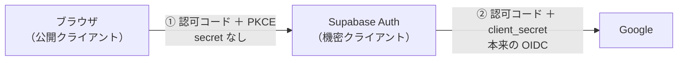
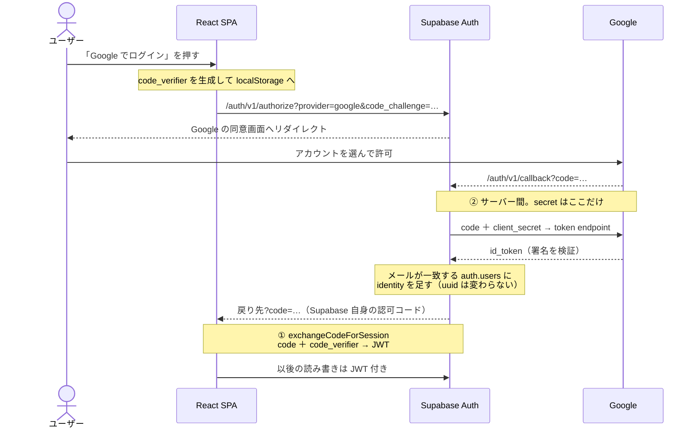

# ログイン機能の計画

**第1段階（メールアドレス＋パスワード）は入りました。** 残っているのはこの1枚、
Google ログインへの差し替えだけです。

第1段階で何が入ったか:

- 認証は **Supabase Auth の Email プロバイダ**。パスワードは `auth.users.encrypted_password`
  にあり、照合も Supabase 内で完結する（`public.users` は削除済み）
- `goals.user_id` は `uuid`（`auth.users(id)`）。`goals` / `avatars` / `records` の3テーブルで RLS が有効
  → [ARCHITECTURE 4章](./ARCHITECTURE.md#4-データモデル)
- React 側は `src/state/useAuth.ts` と `src/pages/LoginPage.tsx`、`App.tsx` のログインゲート
- **登録画面は無い。** アカウントは Supabase の管理画面 Authentication → Users で手作業で配る
  （Confirm email は OFF、Allow new users to sign up も OFF）
- ログイン ID は**本人の Gmail アドレス**。理由は下記（同じメールなら uuid が変わらない）

---

## Google ログインに移る

**いつ**：第1段階が落ち着き、パスワードの配布・紛失が面倒になったら。急がない。

### 変わらないもの

- `schema.sql`（uuid 化・RLS・ポリシー）
- `useGoalState` / `useApp` / `App.tsx` のゲート
- `useAuth` の `user` / `ready` / `signOut`
- 既存データ（Gmail アドレスで作ってあれば uuid が変わらない）

### 変わるもの（2つだけ）

1. `useAuth` の `signIn` を、引数なしで `signInWithOAuth({ provider: 'google', options: { redirectTo: window.location.origin } })` を呼ぶだけの関数に差し替え
2. `LoginPage` の入力欄2つをボタン1つに

### OIDC を自前で書かない理由

| | 自前実装 | Supabase の Google プロバイダ |
| --- | --- | --- |
| 書くコード | 認可コードフロー・PKCE・トークン検証・セッション管理 | `signInWithOAuth` の1行 |
| client secret | 自前サーバーが要る（静的ホスティングを諦める） | Supabase の管理画面 |

### 流れ：認可コードの交換が2回

- `signInWithOAuth` は Google を叩かず、`/auth/v1/authorize` へ遷移するだけ
- ブラウザは secret を持てないので ① は PKCE（5分・1回限り）。`detectSessionInUrl` が自動で交換
- Google 側のエンドポイント URL は設定しない（GoTrue に埋め込み済み）
- 戻りの `?code=` 交換は supabase-js が自動でやり、結果は `onAuthStateChange` に来る

### 手順

- [ ] GCP：OAuth 同意画面を設定
- [ ] GCP：認証情報 → OAuth クライアント ID → ウェブ アプリケーション
- [ ] GCP：承認済みリダイレクト URI を2つ登録（開発用と共有の `https://<ref>.supabase.co/auth/v1/callback`）
- [ ] Supabase：Providers → Google を有効化し client ID / secret を貼る
- [ ] Supabase：URL Configuration に `http://localhost:5173`（と本番 URL）
- [ ] Supabase：identity の自動リンク（同一メールを同じユーザーにまとめる）が有効か確認
- [ ] コード：`signIn` と `LoginPage` を差し替え
- [ ] 確認：**第1段階のデータが Google ログイン後も見える**（uuid が変わっていない証拠。ここが本番）
- [ ] 全員が移行できたら Email プロバイダを無効化
