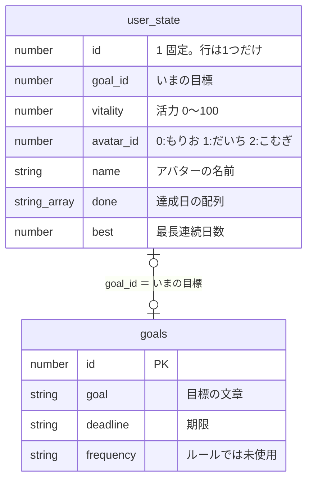
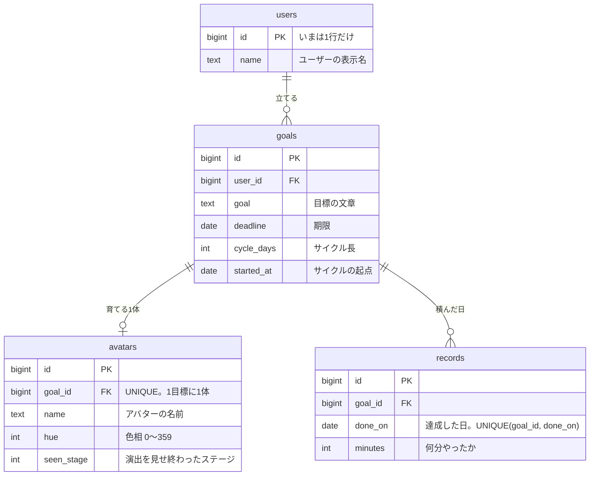

# 何が変わったか — 活力をやめて「連続サイクル」にした

2026年9月の大改修のまとめ。**以前はこうだった → いまはこう**だけを書いています。
いまのルールの詳しい説明は [README 2章](./README.md#2-ゲームのルール)、
データの持ち方は [ARCHITECTURE 4章](./ARCHITECTURE.md#4-データモデル)を見てください。

---

## 1. ひとことで

**「活力」という数字を捨てて、アバターの見た目を全部「達成の記録」から計算するようにしました。**

- 以前: 活力（0〜100）を DB に保存し、達成で `+12`、サボりで `−20` して増減させていた
- いま: 保存するのは「どの日につけたか」だけ。連続数も気分もステージも**画面を描くたびに計算する**

> **なぜ変えたか**
> 活力は記録から計算できる値なのに保存していたので、**読み込みのタイミングでズレました**
> （再読み込みをまたぐとサボりぶんの減少が正しく再現できない）。
> 計算できるものを保存しなければ、いつどの端末で開いても同じ絵になります。

---

## 2. ルールの変更

### 全体の対応（以前 → いま）

| 軸 | 以前 | いま |
| --- | --- | --- |
| 判定の単位 | 1日 | **サイクル（n日に1回の n）** |
| 進化の軸 | のべ達成日数 | 連続サイクル数・直近5サイクルの達成数 |
| 調子の軸 | 活力 0〜100。DB に保存し `+12` / `−20` で増減 | 気分6段階。連続・放置サイクルから**毎回その場で計算** |
| アバターの選択 | 種類3つ（もりお／だいち／こむぎ） | 色（色相）6つ |
| 頻度の設定 | `frequency`（毎日／週3回／週1回／決めてない）。**ルールに未使用** | `cycle_days`（1 / 2 / 3 / 7）。**難易度そのもの** |

### 「日」ではなく「サイクル」で数える

| | 以前 | いま |
| --- | --- | --- |
| 連続 | 毎日つけないと途切れる | 決めたペースで1回つければ続く |
| 週1回の人 | 週6日ぶんサボり扱い | 1サイクル達成。**毎回しょんぼりしない** |
| 猶予 | なし（サボった日は即減点） | **1サイクルぶん**（定義から自然に出る） |
| 起点 | なし | 目標を作った日（`goals.started_at`） |

- 1サイクルに何回つけても**1サイクル達成**。進行中のサイクルも、つけた時点で連続に数える
- **ペースはあとから変えられません**（変えると過去の記録の所属サイクルが変わるため）

### 進化の条件

| ステージ | 以前（のべ達成日数） | いま（続け方） | 増えるもの |
| --- | --- | --- | --- |
| 0 たまご | （デバッグ画面専用） | 初期状態 | 殻だけ。気分を持たない |
| 1 幼体 | 0日〜（ひよこ） | **2サイクル連続** | からだ・あし・くちばし・小さいとさか |
| 2 成体 | 3日〜／7日〜（つばさ・大きく） | **直近5サイクルのうち4サイクル** | つばさ ＋ 一回り大きく ＋ とさか |
| 3 完全体 | 14日〜／30日〜／60日〜 | **14サイクル連続** | マフラー ＋ 冠 |

段階が 1〜6 から 0〜3 に減り、**たまごが最初の姿としてダッシュボードに出る**ようになりました。

| 変えたところ | 以前 | いま | なぜ |
| --- | --- | --- | --- |
| 進捗の出し方 | 「あと N 日」 | `連続 5 / 14 サイクル` の **`x / y`** | 「直近5で4」はサボるほど必要回数が増え、「あと○回」が嘘になる |
| 判定のしかた | いまの日数で当てはまる最大の段階 | **起点から1サイクルずつ、次の条件だけ**を見る | 最大を採ると、たまごから成体へ飛んでしまう |
| 演出 | ブラウザに記録（端末ごと） | `avatars.seen_stage` に記録し**1回だけ** | 別の端末で開いても2回流れない |

### 活力5段階 → 気分6段階

| 以前（活力） | いま（気分） | いまの条件 |
| --- | --- | --- |
| ボロボロ（0〜19） | ぐったり | 3サイクル放置 |
| しょんぼり（20〜44） | うつむき | 2サイクル放置 |
| ふつう（45〜69） | **廃止** | 記録があれば必ず連続1以上なので、出番が無い |
| — | すこし元気 | 連続1サイクル |
| 元気（70〜89） | 元気 | 連続2サイクル |
| 絶好調（90〜100） | いきいき | 連続3〜6サイクル |
| — | **かがやき（新）** | 連続7サイクル以上。光の粒が舞う |

- **落ち込みは彩度で表し、明度は下げない**ようにした（暗く沈めると汚く見えるため。下限 58）
- **色相はユーザーが選んだ色に固定**した（以前は活力で色が動き、選んだ色が画面から消えることがあった）
- 気分はステージ1以上のもの。**たまごに気分はありません**

### アバターの「種類」が「色」に

| | 以前 | いま |
| --- | --- | --- |
| 選ぶもの | もりお／だいち／こむぎ（中身は色相の違いだけ） | 色（色相）6つ |
| 増やし方 | `AVATARS`（名前）と `VARIANTS`（色相）を**同じ並び順で**足す | `HUES` に数字を1つ足すだけ |
| 名前 | 任意（種類ごとの既定値あり） | **必須入力** |
| 選択画面 | 3Dの見本が3枚並ぶ（重い） | **3Dは1体だけ**。色は CSS の丸で選ぶ |

---

## 3. データの持ち方の変更

### 以前 — `user_state` 1行を丸ごと UPSERT

状態が変わるたびに、**達成日の配列ごと1行を送り直して**いました。

### いま — 4テーブル。達成は1行 INSERT だけ

### 何がどう変わったか

| 変更 | 何が良くなったか |
| --- | --- |
| `done` 配列 → `records` テーブル | 同じ日の重複を**DB側**（UNIQUE 制約）が弾く。目標ごとに履歴が残る |
| `vitality` / `best` を捨てた | 計算できる値を持たなくなったので**ズレようがない** |
| `avatars` を独立させた | 見た目のカスタマイズで列が増えても、目標や記録と混ざらない |
| `avatar_id`（0〜2）→ `hue`（0〜359） | 並び順の決まりごとが消え、色を足すのが数字1つで済む |
| `frequency` → `cycle_days` | 週ベースだと「週の始まりは何曜日か」という2つ目の起点が要るのをやめた |
| `started_at` を追加 | サイクルの起点。記録が空でも数えられ、記録が増えても動かない |
| 目標を作り直しても行を残す | **過去の記録とアバターが消えない。** いまの目標は `id` が最大の1件 |
| `user_state` → `users` | `id = 1` 固定をやめ、「誰が開いても同じデータ」から抜ける道をつけた |

### 書き込みのタイミング

| いつ | 以前 | いま |
| --- | --- | --- |
| 起動 | `user_state`(id=1) を1回 select し、**サボり日数ぶん活力を減らす** | `goals` ＋ `avatars` ＋ `records` を select するだけ |
| 1日達成 | `done` 配列に足して**1行を丸ごと UPSERT** | `records` に **INSERT 1行** |
| 画面を描くとき | 保存された活力を読む | **なし**（記録から毎回その場で計算） |
| 目標の作り直し | 古い `goals` は残すが、達成履歴は**空に戻る** | 新しい行を足すだけ。**記録もアバターも残す** |

**DB に残っている唯一の「計算できない保存値」は `avatars.seen_stage`**（進化の演出をどこまで
見せたか）です。これだけは記録から計算できないので保存しています。

> **移行のやり方**: 既存のプロジェクトを書き換えず、**新しい Supabase プロジェクトを作って
> [`supabase/schema.sql`](./supabase/schema.sql) を1本流しました。** `ALTER` も `DROP` も無いので、
> 旧プロジェクトは無傷のままです。切り替わるのは各自が `.env` を差し替えた瞬間。
> **既存データは移していません**（新しい DB は空なので、初回起動は目標設定画面から）。

---

## 4. 画面の変更

- **ダッシュボード**: 活力ゲージ → **進化ゲージ**（枠は流用し、ラベルと満たし方だけ変更）。
  「🔥 N日連続」は「🔥 N サイクル連続」に
- **進化の演出**: 条件を満たした瞬間に**1回だけ**流れるようになった。たまごは殻が割れるところから。
  7サイクル連続（かがやき）では光の粒が舞う
- **目標設定**: 頻度4択 → 「n日に1回」、アバター3種 → 色選び。
  見本の3Dは**1体だけ**になった（以前は選択肢ごとに3Dが3枚並んでいて重かった）
- **「新しい目標をはじめる」に確認ダイアログ**を足した（押すとアバターがたまごに戻るため）
- **カレンダー・案内・デバッグ画面**も同じ単位（サイクル・気分・ステージ）に揃えた

---

## 5. 開発のしかたの変更

- **テスト（vitest）を入れました。** `npm test` でルールの純粋関数だけを動かします
  （サイクルの数え方・気分・進化条件を37件）
- 時刻に依存していていちばんテストしづらかった `rollover()`（起動時のやつれ判定）は、
  **仕事が無くなったので関数ごと消えました**

---

## 6. はじめての人向けの用語

| 言葉 | 意味 | このアプリでの例 |
| --- | --- | --- |
| 導出値 | 他のデータから計算できる値 | 連続サイクル数・気分・ステージ。**保存しない** |
| 正規化 | 1つの事実を1か所にだけ置くこと | 達成日を配列ではなく `records` の1行にした |
| 一意制約（UNIQUE） | 「同じ組み合わせは1つだけ」という DB のルール | 同じ日に2回つけても1行にしかならない |
| マイグレーション | DB の形を変える作業 | 今回は新プロジェクトに `CREATE` を1本流した |
| 段階的移行 | 新しい仕組みを足す → 使う側を移す → 古い仕組みを消す、の順で進めること | PR #34 →#38 → #39 |

---

## 7. 残っている宿題

- **ペース（`cycle_days`）をあとから変えられるようにするか。** いまは「変えたいなら新しい目標＝
  たまごから」なので、毎日に設定した人の逃げ道がアバターの作り直しだけになっている
- 目標作成は `goals` → `avatars` の2回の INSERT で、**トランザクションではない**（片方だけ成功しうる）
- 認証と RLS（誰のデータかの区別）は**まだ**。いまは誰が開いても同じデータ

詳細は [ARCHITECTURE 5章](./ARCHITECTURE.md#5-既知の制約課題)、担当は [TEAM 3章](./TEAM.md#3-いまのタスク)。

---

## 8. どの PR で何をしたか

| PR | 内容 |
| --- | --- |
| #33 | vitest を入れる |
| #34 | サイクルの計算・気分・進化条件を**追加**（旧ルールは残したまま） |
| #35 | 新しい Supabase プロジェクトのスキーマ（`supabase/schema.sql`） |
| #36 | 読み書きを4テーブル構成へ |
| #37 | アバターを「ステージ × 気分 × 色相」で描くように |
| #38 | 画面5つとカレンダーを新しいルールへ |
| #39 | 活力まわりの旧コードを削除 |
| #40 | 進化の演出（孵化・かがやき） |
| #41 | ドキュメント更新（この文書を含む） |

**旧ルールを消したのは最後（#39）です。** 新しいものを足す → 使う側を1つずつ移す →
誰も使わなくなってから消す、の順にすると、どの時点でも `main` が壊れません。
