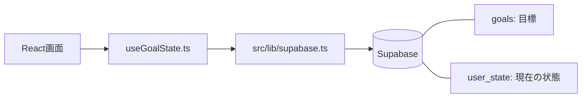
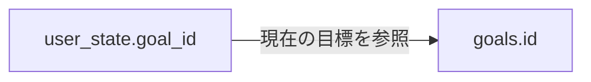

# データベース構成

現在のアプリは Supabase に目標とアバターの状態を保存しています。この資料はリポジトリ内の実装をもとにまとめたものです。実際のDBのDDLやマイグレーションはリポジトリ内にないため、SQLの型、主キー・外部キー制約、NULL制約、デフォルト値、インデックス、RLSポリシーは未確認です。

既存の [ARCHITECTURE.md](./ARCHITECTURE.md) には localStorage を保存先とする旧構成の記述が残っています。現在のDBアクセスについては、この資料と [useGoalState.ts](./src/state/useGoalState.ts) を参照してください。

## 接続構成

接続クライアントは [src/lib/supabase.ts](./src/lib/supabase.ts) で生成します。設定する環境変数は [.env.example](./.env.example) にあります。

| 環境変数 | 用途 |
| --- | --- |
| `VITE_SUPABASE_URL` | SupabaseプロジェクトのURL |
| `VITE_SUPABASE_ANON_KEY` | Supabase接続用のanon key |

## テーブルと関連

コードが参照するテーブルは `goals` と `user_state` の2つです。`user_state.goal_id` から現在の目標を参照する構成を想定しています。読み込み時は `goals (...)` という関連取得を使っていますが、実際の外部キー制約や関連の件数制限は未確認です。

以下の「アプリ上の型」はTypeScriptの状態や送受信する値を示し、実際のSQL型・DB制約を示すものではありません。

### goals — 目標

| カラム | アプリ上の型 | 内容・利用方法 |
| --- | --- | --- |
| `id` | `number` | 目標ID。作成時には送信せず、作成後に返された値を使用 |
| `goal` | `string` | 目標の文章 |
| `deadline` | `string` / `null` | 期限。日付文字列は `YYYY-MM-DD`。作成時は文字列を送信 |
| `frequency` | `Frequency` | 取り組む頻度。下表の識別値を保存 |

| frequencyの値 | 表示名 |
| --- | --- |
| `everyday` | 毎日 |
| `week3` | 週3回 |
| `week1` | 週1回 |
| `any` | 決めてない |

### user_state — 現在の状態

| カラム | アプリ上の型 | 対応するState項目 | 内容 |
| --- | --- | --- | --- |
| `id` | `number` | なし | 読み書きともに現在は `1` 固定 |
| `goal_id` | `number` / `null` | `goalId` | 現在取り組んでいる目標のID |
| `vitality` | `number` | `vitality` | 活力。アプリの計算では0〜100 |
| `avatar_id` | `0` / `1` / `2` | `avatarId` | アバターの種類 |
| `name` | `string` | `name` | アバターの名前 |
| `done` | `string[]` | `done` | 達成日リスト。各要素は `YYYY-MM-DD` |
| `best` | `number` | `best` | 最長連続達成日数 |

`avatar_id` は `0 = もりお`、`1 = だいち`、`2 = こむぎ` です。`done` の実際の保存型がSQL配列かJSONかは、コードだけでは確定できません。

現在の実装には認証ユーザーごとのID切り替えがなく、すべての操作が `user_state.id = 1` を対象にします。DBのアクセス権限は別途確認が必要です。

## 読み書きの流れ

| 操作 | DBへの処理 | アプリ側の動作 |
| --- | --- | --- |
| 起動 | `user_state` の `id = 1` を `maybeSingle()` で取得。関連する `goals` の `id, goal, deadline, frequency` も取得 | Stateに変換し、`rollover()` を適用 |
| 目標作成 | `goals` に `goal, deadline, frequency` をINSERTし、`id` を取得 | `resetGoal()` で活力50・履歴空・最長記録0にし、新しい目標を設定 |
| 状態保存 | `user_state` を `id = 1` でUPSERT | `loaded && hasStarted` のとき、状態変更に応じて保存 |
| 今日の達成 | 状態保存を通じて `user_state` を更新 | 達成日を追加し、活力を12増加。同じ日の重複達成は加算しない |
| 次の日へ進める | 状態保存を通じて `user_state` を更新 | 日付を進め、未達成日について活力を20減少 |
| 期限延長 | 現在の `goalId` に一致する `goals.deadline` をUPDATE | 更新成功後に画面上の期限を1か月延長 |
| 目標の作り直し開始 | この時点ではDBを書き換えない | `hasStarted = false` にして状態をリセットし、設定画面へ移動 |
| 全体リセット | DBの削除処理なし | ローカルの状態を `initialState()` に戻す |

目標作成のINSERTと状態保存のUPSERTは別々の非同期処理です。目標作成成功は、`user_state` の保存完了を意味しません。状態保存に失敗した場合はコンソールにエラーを出します。

目標を作り直しても古い `goals` レコードは削除されません。一方、達成履歴は `user_state.done` にある現在の履歴だけで、新しい目標の作成時に空になります。過去の目標ごとの達成履歴を保存・取得する処理はありません。

## 初期値と読み込み時の補完

これらはアプリ側の値であり、DBのデフォルト値ではありません。

| 項目 | アプリ起動時の初期値 | DB取得値がnullまたはundefinedの場合 | 目標作成成功時 |
| --- | --- | --- | --- |
| `vitality` | `62` | `100` | `50` |
| `goalId` | `null` | `null` | 新しく作成された目標ID |
| `goal` | `資格の勉強` | 空文字 | 入力値 |
| `deadline` | `null` | `null` | 入力値 |
| `frequency` | `any` | `any` | 入力値 |
| `avatarId` | `0` | `0` | 入力値 |
| `name` | `もりお` | 空文字 | 入力値 |
| `done` | `[]` | `[]` | `[]` |
| `best` | `0` | `0` | `0` |

DBに `user_state` の対象行がない場合は初期状態のままになります。既存行がある場合は、その保存済みの活力が優先されます。

## DBに保存していない状態

| 項目 | 用途 | 再読み込み時の扱い |
| --- | --- | --- |
| `lastDate` | 最後に日付更新を処理した日 | 初期値 `null` から読み込み時の `rollover()` で当日を設定 |
| `dayOffset` | 日付を進める操作のオフセット | `0` に戻る |
| `loaded`, `hasStarted` | 読み込み・開始状況 | hook内で再設定 |
| 画面・タイマー状態 | 現在の画面、経過秒数、実行状況 | DBへの保存処理なし |

`lastDate` を保存・復元していないため、現在の実装では再読み込みをまたいだ未達成日数による活力減少を正しく再現できません。また、作り直しの設定中や全体リセット後に再読み込みすると、DBに残っている前回の状態を読み込みます。

## 関連ファイル

- [src/lib/supabase.ts](./src/lib/supabase.ts): 接続クライアント
- [src/state/useGoalState.ts](./src/state/useGoalState.ts): 読み込み、目標作成、期限更新、状態保存
- [src/state/logic.ts](./src/state/logic.ts): State型、初期値、活力・達成・リセットのルール
- [src/state/useApp.ts](./src/state/useApp.ts): 目標作成と画面遷移の連携
