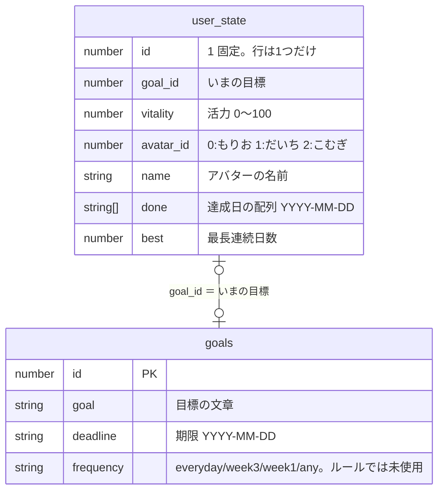
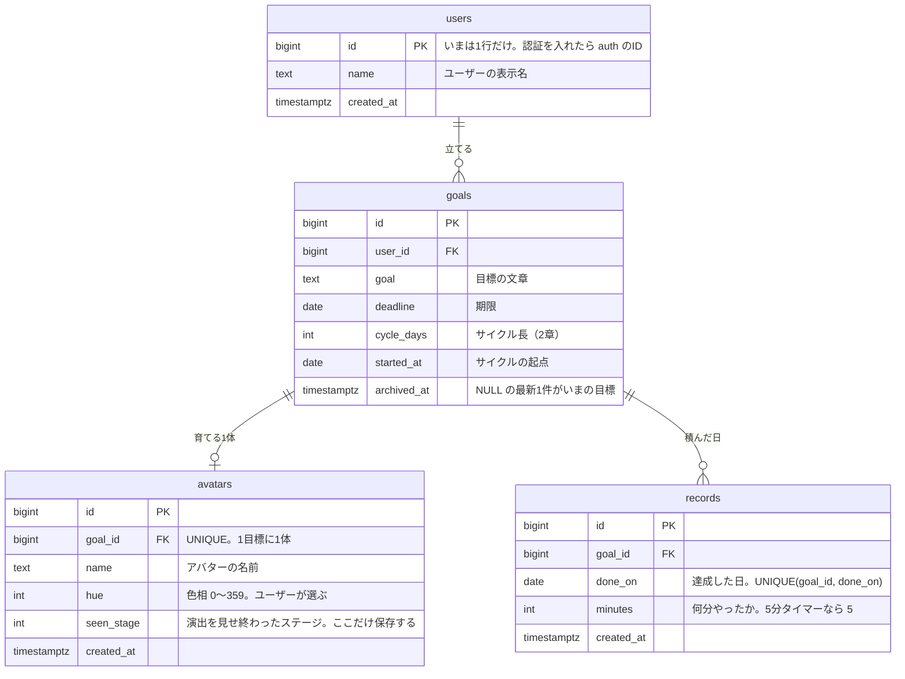

# 活力をやめて「連続サイクル」に一本化する — 修正方針

いまの仕様は [README 2章](./README.md#2-ゲームのルール)。この文書は**何をどう変えるか**だけを書く。
実装が終わったら README / ARCHITECTURE へ取り込み、このファイルは消す。

---

## 1. 方針

**活力（0〜100 の保存値）を廃止し、見た目のすべてを「達成の記録」と「サイクル長」から計算する。**

| | いま | これから |
| --- | --- | --- |
| 進化の軸 | のべ達成日数 | 連続サイクル数・直近5サイクルの達成数 |
| 調子の軸 | 活力。DBに保存し `GAIN`/`DECAY` で増減 | 連続・放置サイクルから**毎回その場で計算** |
| 保存するもの | `vitality` / `lastDate` | **なし**（例外は `avatars.seen_stage` だけ） |

**原則: 記録から計算できるものは保存しない。** `vitality` は計算できるのに持っていたのでズレた。
唯一の例外は「進化の演出をどこまで見せたか」で、これは記録から計算できない（2章）。

[ARCHITECTURE 5章](./ARCHITECTURE.md#5-既知の制約課題)の課題も3つ片付く。`lastDate` 未保存は
**課題ごと消滅**、目標ごとの履歴は `records` が `goal_id` を持つので**残る**、
テストは時刻依存でいちばん書きにくかった `rollover()` が**消える**。

---

## 2. 新しいルール

### サイクル ― すべての判定の単位

**「n日に1回」だけを設定させ、連続もサボりも「日」ではなく「サイクル」で数える。**
頻度が難易度設定として働き、週1回の人が毎回しょんぼりすることがなくなる。

| 設定 | サイクル長 | 「連続」の意味 |
| --- | --- | --- |
| 1日に1回 | 1日 | 毎日つける |
| 2日に1回 | 2日 | 2日に1回つける |
| 3日に1回 | 3日 | 3日に1回つける |
| 7日に1回 | 7日 | 週に1回つける |

**「週3回」のような週ベースはやめる。** 週の境界（何曜日始まり）という2つ目の起点が要るうえ、
7 ÷ 3 が割り切れず表示と中身が食い違う。n日なら数値ひとつで済む。

`frequency`（`everyday` / `week3` / `week1` / `any`）は**いまルールに一切使われていない**
（`SetupPage` で選んで保存するだけ。`freqLabel()` は呼び出し0件）。差し替えコストが
最小の今のうちに、**数値の `cycle_days` へ置き換える**（3章）。

- 判定はすべて**日単位**。境界は**初日の午前0時**（`done` は `YYYY-MM-DD` で時刻を持たない）
- **起点は目標を作った日**（`goals.started_at`）。`cycleIndex(d) = floor((d − started_at) / cycle_days)`。
  最初の達成日を起点にすると、記録が無いあいだサイクルが定義できない
- **頻度は目標ごとに固定。あとから変えられない** ⚑（変えたいときは新しい目標＝たまごから）。
  `cycle_days` を変えると過去の全記録の所属サイクルが変わるので、「過去を切り直さずに変える」
  には変更履歴のテーブルが要る。いまの画面にも導線が無い。
  **あとから足すなら `cycle_days` と `started_at` を同時に更新して「連続だけ切る」**形にする
  （ステージは下がらないのでアバターは維持。`cycleIndex` が起点より前の記録を捨てる作りにしておく）
- 1サイクルに何回つけても**1サイクル達成**
- **進行中のサイクルも、つけた時点で連続に数える**。でないとごほうびが1サイクル遅れる

### 進化（ステージ 0〜3）

| ステージ | 到達条件 | 見た目（既存パーツの割り当て直し） |
| --- | --- | --- |
| 0 たまご | 初期状態 | `Egg`。**気分を持たない1状態だけ**。いまはデバッグ画面にしか出ていないので、ダッシュボードに出す |
| 1 幼体 | 2サイクル連続 | からだ・あし・くちばし・小さいとさか |
| 2 成体 | 過去5サイクルのうち合計4サイクル | つばさ ＋ 一回り大きく ＋ とさかが立派に |
| 3 究極体（仮） | 14サイクル連続 | マフラー ＋ 冠 |

- **一度上がったステージは下がらない。** 「一度でも条件を満たしたか」を見るだけなので保存は増えない
- 判定は**起点サイクルから1サイクルずつ走査**し、その時点のステージの**次の条件だけ**を見る。
  いまの値で当てはまる最大のステージを取ると卵から成体へ飛ぶ
  （`✓✓✓✓✗` のサイクルは `run = 0` なのに「過去5で4」が成立する）
- **進捗は「あと○」ではなく `x / y` で出す。** ステージ2は窓の条件なので「あと○回」が嘘になる
  （サボると数が増え、しかもその回数では届かない）。`nextGoalOf()` が
  `{ kind: 'run' | 'window', have, need }` を返し、画面は `連続 5 / 14 サイクル` /
  `直近5サイクルで 3 / 4` と出す。**活力ゲージ（`.meter` / `.gauge`）をそのまま流用できる**
- **演出は条件を満たした瞬間に1回だけ。** 計算したステージが `avatars.seen_stage` を超えていたら
  その差のぶんだけ流し、`seen_stage` を更新する。`localStorage` と違って別の端末でも効く。
  **保存するのは演出の番号だけで、ステージそのものは保存しない**
- **ステージ番号の付け替えに注意。** いまの `STAGES` は 1〜6 で、`look.ts` が番号を直接見ている（4章）
- `stageOf()` / `daysToNextStage()`（呼び出し0件）は `evolutionOf()` / `nextGoalOf()` に置き換えて消す
- **14サイクル連続は重い**（週1回なら98日で、期限の既定1か月を超える）。条件は `stage.ts` の
  表1か所に閉じ込め、あとから数字だけ動かせるようにしておく

### 連続ボーナス（気分）

**気分はステージ1以上のもの。卵に気分は無く、見た目は1状態だけ。**

今のサイクルを `c`、達成の記録があるいちばん新しいサイクルを `last` とする。

- `idle` = `c − last`（今のサイクルを達成済みなら 0）
- `run` = `last` を末尾とする連続達成サイクル数。**ただし `idle >= 2` なら 0**

`idle == 1`（直前サイクル達成・今のサイクルは未達）でも `run` が残るので、
**1サイクルぶんの猶予は定義から自然に出る。** 据え置き用の分岐は要らない。

**落ち込みは彩度で表す。明度は下げない**（下限 58。暗く沈めると汚く見えるし、
前かがみ `droop` と汗で十分沈んで見える）。

| 気分 | 条件（上から順に見る） | 彩度 / 明度 | `liveliness` | ほか |
| --- | --- | --- | --- | --- |
| ぐったり | `idle >= 3`（3サイクル放置） | 8 / 58 | 0.0（座り込む） | 苦しそう・汗 |
| うつむき | `idle == 2`（2サイクル放置） | 18 / 58 | 0.2（あんまり動かない） | — |
| すこし元気 | `run == 1` | 34 / 66 | 0.4（少しだけ動く） | — |
| 元気 | `run == 2` | 44 / 72 | 0.6（ちゃんと生きる） | — |
| いきいき | `run` 3〜6 | 56 / 80 | 0.9（いっぱい動く） | — |
| かがやき | `run >= 7` | 同上 | 1.0 | **豪華なエフェクト** |

- **「ふつう」の段階は要らない。** ステージ1以上なら必ず記録があるので、記録なしは卵しかありえない。
  `moodOf()` は記録が無ければ「気分なし」を返し、`look.ts` はステージ0では気分を見ない
- **卵の色は `hue` だけで決める**（彩度 24 / 明度 88 に固定）。いまは `Egg` が
  `look.bellyColor`（活力で動く色）で殻を塗っている
- `liveliness` は `Chick.tsx` がそのまま使える。ただし**いま 0.25 以下で座り込む**ので、
  うつむき（0.2）が座らないよう `pick()` の閾値を下げる（4章）
- **アクセント色（`--h` / `--s`）は色相を `hue` に固定し、彩度だけ気分で動かす。**
  色相まで動かすと、ユーザーが選んだ色が画面から消える
- **新規に作るのは「豪華なエフェクト」だけ。** 一度消した `Sparkles` を戻すか、Blender に
  クリップを1本足すか（[avatar/README の約束ごと](./src/avatar/README.md#約束ごと)に従うなら後者）

---

## 3. DB

### いま（コードから確定。DDL はリポジトリに無い）



> 型は**アプリ側の型**。**何を置き換えるのかの記録**で、新しいプロジェクトを作るのでこの形は直さない。

| いつ | 何をしているか |
| --- | --- |
| 起動 | `user_state`(id=1) を `goals` ごと1回 `select` |
| 目標作成 | `goals` に INSERT して `id` を得る |
| 状態が変わるたび | `user_state` を id=1 で **丸ごと UPSERT**（`done` 配列も毎回そのまま送る） |
| 1日達成 | `done` 配列に日付を push（同日は `includes` で弾く） |
| 目標の作り直し | 古い `goals` は**残す**。`done` は空に戻す |
| 削除 | **一切しない** |

### 修正案

**アバターは目標と 1:1。** 1つの目標につき1体を、たまごから育てる。



- ステージは**その目標の `records` だけ**を集計する。
  **目標を作り直すと新しいアバターがたまごから始まる**（前の1体と記録は残る）
- **カスタマイズは `avatars` に列を足していく。** `hue` が最初の1つ。増えたら `jsonb` 1列にまとめる
- **`seen_stage` だけが「計算できない保存値」**（2章）
- **目標作成は `goals` → `avatars` の2回で、トランザクションではない。** 片方だけ成功する余地は
  残る（ARCHITECTURE 5章データまわり4つ目と同じ話）。**今回は直さない**
- **認証と RLS は今回やらない。** `users` / `user_id` を通しておくのは、あとから張れる形にするため

### 変更理由

| 変更 | 理由 |
| --- | --- |
| `avatars` を独立させ、`goals` と 1:1 | 見た目のカスタマイズで列が増えるので、目標や記録と同じ行に混ぜない |
| `avatar_id`（0〜2）→ `hue`（0〜359） | いまの `avatar_id` は色相を引く番号でしかない。`AVATARS` と `VARIANTS` の並び順を揃える決まりごとも消える |
| `done` 配列 → `records` テーブル | 配列ごと再送が1行 INSERT になり、同日重複を DB の UNIQUE が防ぐ。目標ごとに履歴が残り、分数も足せる |
| `best` / `vitality` を捨てる | 記録から計算できる導出値。持つとズレる（「最長記録」は `bestRun()` に置き換え） |
| `frequency` → `cycle_days` | 週ベースだと週の境界が要る（2章） |
| `started_at` を足す | サイクルの起点。記録が空でも数えられ、記録が増えても動かない |
| `archived_at` を足す | 「いまの目標」が SQL で引けるようになり、`user_state.goal_id` が要らなくなる |
| `user_state` を `users` にする | `id = 1` 固定をやめ、「誰が開いても同じデータ」から抜ける道をつける |

### 作り方 ― Supabase プロジェクトごと作り直す

**いまのプロジェクトは書き換えず、新しいプロジェクトを作って `CREATE` を1本流す。**
`ALTER` / `DROP` がゼロになり、**旧プロジェクトを触らないので古いコードが最後まで無傷。**
切り替わるのは各自が #4 を pull して `.env` を差し替えた瞬間（`.env` は gitignore 済み）なので、
DB とコードがズレない。DDL を自分で書くので `supabase/schema.sql` としてコミットできる。

**既存データは移さない。** 新しい DB は空なので、初回起動は目標設定画面から始まる。

```sql
-- 新しいプロジェクトに1本流すだけ。supabase/schema.sql がこの原典になる

CREATE TABLE users (
  id         bigserial PRIMARY KEY,
  name       text NOT NULL DEFAULT '',   -- 入力欄は認証と一緒に作る
  created_at timestamptz NOT NULL DEFAULT now()
);

CREATE TABLE goals (
  id          bigserial PRIMARY KEY,
  user_id     bigint NOT NULL REFERENCES users(id),
  goal        text   NOT NULL,
  -- 目標設定画面が必須にしているので NOT NULL。
  -- 「まだ目標が無い」は deadline の NULL ではなく「goals に行が無い」で表す
  deadline    date   NOT NULL,
  cycle_days  int    NOT NULL DEFAULT 1,  -- サイクル長（2章）
  started_at  date   NOT NULL DEFAULT current_date,
  archived_at timestamptz,                -- NULL の最新1件がいまの目標
  created_at  timestamptz NOT NULL DEFAULT now()
);

CREATE TABLE avatars (
  id         bigserial PRIMARY KEY,
  goal_id    bigint NOT NULL UNIQUE REFERENCES goals(id),
  name       text   NOT NULL,             -- 必須入力にしたので DEFAULT を置かない
  hue        int    NOT NULL DEFAULT 150,
  seen_stage int    NOT NULL DEFAULT 0,   -- 0 = まだ何も見せていない（たまご）
  created_at timestamptz NOT NULL DEFAULT now()
);

CREATE TABLE records (
  id         bigserial PRIMARY KEY,
  goal_id    bigint NOT NULL REFERENCES goals(id),
  done_on    date   NOT NULL,
  minutes    int    NOT NULL DEFAULT 5,
  created_at timestamptz NOT NULL DEFAULT now(),
  UNIQUE (goal_id, done_on)
);

CREATE INDEX goals_current_idx ON goals (user_id, archived_at, id DESC);
CREATE INDEX records_goal_idx  ON records (goal_id, done_on);

-- ユーザーは1行だけ。**id は明示せず連番に任せる**（結果 1 になる）。
-- 明示すると bigserial のシーケンスが進まず、次の INSERT が id=1 で衝突する
INSERT INTO users (name) VALUES ('');
```

- **organization は新しく作る**（他用途の組織に混ぜると権限とメンバーを分けられない）。
  組織の作成だけはダッシュボードでしかできない
- **free プロジェクトはアカウント全体で active 2つまで**（休止中は数えない）。組織内の
  Owner / Admin 全員の枠が合算されるので、**メンバーは Developer ロールで招待する**
- リージョンは `ap-northeast-1`（東京）
- **URL と anon key はチャットで共有し、git には入れない**（`.env` の差し替え手順は README 3章へ）
- `CREATE TABLE` で作ったテーブルは**既定で RLS 無効**。いまと同じ状態なので今回はそのまま
- **旧プロジェクトは消さない。** 全部動いてから1〜2週間見て、ダッシュボードで休止する

### 新しい運用

| いつ | DB 操作 |
| --- | --- |
| 起動 | `goals`（`archived_at IS NULL` の最新1件）に `avatars` を join して `select` ＋ その `records` を `select` |
| 目標作成 | `goals` に INSERT（`started_at = 今日`）→ 返った `id` で `avatars` に INSERT |
| 1日達成 | `records` に **INSERT 1行**（同日は UNIQUE が弾く） |
| 名前・色の変更 | `avatars` を UPDATE |
| 進化の演出を流し終わった | `avatars.seen_stage` を UPDATE（2章） |
| 期限延長 | `goals.deadline` を UPDATE |
| 目標の作り直し | 旧 `goals.archived_at` を入れて、新しい `goals` ＋ `avatars` を INSERT。**記録もアバターも消さない** |
| 画面を描くとき | **なし**。`records` と `cycle_days` / `started_at` から毎回その場で計算する |

- **1日1行なので `minutes` に残るのは最初のセッションぶんだけ。** 判定にも表示にも使っていない
  ので**初回のみで始める**（合計が要るなら `ON CONFLICT ... DO UPDATE` に変えるだけ）

---

## 4. ファイルごとの修正

| ファイル | 修正 |
| --- | --- |
| `src/state/logic.ts` | **削除**: `GAIN` `DECAY` `LEVELS` `Level` `levelOf()` `clamp()` `rollover()`（仕事が無くなるので関数ごと）`State.vitality` `State.lastDate` `State.best`（`markDone` 内の更新も）`Frequency` `FREQUENCIES` `freqLabel()` `AvatarId` `AVATARS` `avatarName()`。<br>**追加**: `State.cycleDays` `State.startedAt` `State.hue`（`avatarId` を置き換え）`State.seenStage`、`cycleIndex()` `runOf()` `idleOf()`、`MOODS`（彩度・明度・`liveliness`）、`moodOf(state)`、`bestRun(state)`。<br>**書き換え**: `streak()` はサイクルを返す。`markDone()` は `done` に足すだけ。<br>**残す**: `State.done`（`records` から作る配列。カレンダーと `isDone()` が使う）、`State.dayOffset` |
| `src/avatar/stage.ts` | `STAGES` を到達条件つきの4段階へ。`evolutionOf(done, cycleDays, startedAt, today)` と `nextGoalOf(...)` を足し、`stageOf()` / `daysToNextStage()` を消す。**`startedAt` が無いとサイクル番号が出せない**ので引数に入れる。**`state/` へ移すか検討**（[TEAM 3章](./TEAM.md#3-いまのタスク)の宿題。移すときは関数名と型を変えない） |
| `src/avatar/look.ts` | 活力の連続補間をやめ**気分のテーブル引き**に。`VARIANTS` を捨て **`hue` を直接受け取る**。**ステージ番号が 1〜6 → 0〜3 になるので `stage / 6`・`wings: >= 2`・`crestScale: >= 4`・`scarf: >= 5`・`crown: >= 6` を全部付け替える**。ステージ0は `isEgg` で、色は `hue` だけから作る |
| `src/avatar/Avatar.tsx` `AvatarCanvas.tsx` | `lv` + `vitality` → `mood`（ステージ0では渡さない）。`variant` → `hue`。**`egg` プロパティの手動上書きをやめ、ステージ判定の結果でたまごになるように**（デバッグ画面用には残す）。`aria-label` の「活力」表記も |
| `src/avatar/Chick.tsx` | `pick()` の `liveliness` 閾値（0.25 → もっと下へ）。`Egg` の殻の色を固定値へ。豪華なエフェクトの分岐 |
| `src/ui/useAccent.ts` | 引数を `Level` から `(hue, s)` へ。**`Level` を消すとここが型エラーになる** |
| `src/pages/MainPage.tsx` | **活力ゲージ（`.meter` / `.gauge`）を進化ゲージに作り替える**（消さずに流用し、ラベルと満たし方だけ変える）。`levelOf(vital)` → `moodOf(state)`。`🔥 N日連続` の単位。期限切れ画面の「最長記録」を `bestRun(state)` に。<br>**「新しい目標をはじめる」に確認を足す**（押すと**アバターがたまごに戻る**。ボタンは目標パネル内と期限切れ画面の2か所） |
| `src/features/calendar/Calendar.tsx` | `連続 N日` をサイクル単位に。（`MonthlyCalendar.tsx` は `State.done` しか見ないので無変更） |
| `src/pages/OnboardingPage.tsx` | 活力の説明ブロック（🌱 活力 54/100）を進化条件の説明へ。`growthExamples` の `vitality` も気分へ |
| `src/pages/OnboardingAvatar.tsx` | **`levelOf` を import している。** `mood` を受け取る形へ（忘れると #7 でビルドが落ちる） |
| `src/pages/DebugPage.tsx` | 活力表示 → 連続 / 放置 / ステージ判定。`user_state` を直接読む `select` も書き換え。たまごの確認用セクションは残す |
| `src/pages/SetupPage.tsx` | **ほぼ作り替え。**<br>・頻度の4択 → **「n日に1回」**。ラベルの「（任意）」を外す（`cycle_days` は必須で難易度の軸）。既定は1日に1回<br>・アバター3種 → **色（`hue`）の選択**。候補に いまの3色 150 / 205 / 344 を入れる<br>・**見本の 3D は1体だけ**（いまは選択肢ごとに WebGL キャンバスが3枚ある）。**色は CSS の丸**で選ぶ。見本は選んだ `hue` ＋ 気分「いきいき」固定<br>・**名前は必須入力**（`AVATARS` が消えると既定値の出どころが無い）。`ready` の条件に名前を足し、`pickAvatar()` の名前自動入力は消す<br>・冒頭の文言「手を止めた日数だけ、アバターは痩せていく」をサイクルと彩度の話に直す<br>・`SetupInput` が `{ goal, deadline, cycleDays, hue, name }` に変わる |
| `src/state/useGoalState.ts` | **いちばん変わる。** 丸ごと UPSERT → 4テーブル構成（3章「新しい運用」）。`State` の形は極力変えない。`rollover()` の呼び出し3か所を消し、`seen_stage` の読み書きを足す。**#4 の時点では旧 `SetupInput` が来る**ので `frequency → cycle_days`（`week1`→7 / `week3`→3 / 他→1）と `avatarId → hue`（0→150 / 1→205 / 2→344）の変換を一時的に置き、**#6 で消す** |
| CSS | `onboarding-page.css` の `.onboarding-vitality` / `.onboarding-meter` を削除。`main-page.css` の `.meter` / `.gauge` は**進化ゲージとして残す**。**`ui/styles.css` の `.freqs` / `.seg` / `.avators` / `.avator-card`（199〜212行）は C の担当ファイル**なので、B が触る前に共有する（[TEAM 1章](./TEAM.md#1-分担ファイルで分ける)） |
| Supabase | 3章のとおり、**新しいプロジェクトに `CREATE` を1本**。SQL は `supabase/schema.sql` へ |
| README / ARCHITECTURE | README 2章まるごと・1章の画面表（「活力ゲージ」）・ARCHITECTURE 3章の `活力 -DECAY` のシーケンス図・4章のデータモデル・5章の課題 |
| `src/avatar/README.md` | 冒頭の3入力の図・「見た目を決める3つの入力」「活力でどう変わるか」「ステージでどう変わるか」の**3つの表**・「たまご（トップページ専用）」の記述（実際はデバッグ画面にしか出ていない）・`liveliness <= 0.25` の記述。**`AVATARS` と `VARIANTS` の並び順の決まりごとは不要になる** |

---

## 5. コミットとPRの単位

[TEAM 5章](./TEAM.md#5-git-の運用ルール)のとおり feature ブランチ → PR → レビュー → マージ。
`state/logic.ts` の公開 API と Supabase を変えるので
**[TEAM 6章](./TEAM.md#6-相談が必要な変更)の「相談が必要な変更」に当たる。** 着手前に3人へ投げること。

**旧 API を消すのは最後。** 新しい API を足す → 使う側を1つずつ移す → 誰も使わなくなってから消す。
この順なら、どの PR も単独で `npm run build` が通り、`main` が壊れない。

| # | ブランチ | 内容 | 担当 | 前提 |
| --- | --- | --- | --- | --- |
| 1 | `chore/add-vitest` | vitest を入れる。`package.json` を触るので TEAM 6章の相談対象 | A | — |
| 2 | `feat/evolution-rules` | `logic.ts` にサイクルの計算・`moodOf()`・`bestRun()`、`stage.ts` に `evolutionOf()` / `nextGoalOf()` を**追加**するだけ。**旧 API は残す**ので見た目は変わらない。テストも一緒に。**DB には触らない** | A | — |
| 3 | `chore/new-supabase-project` | **新しい organization と Supabase プロジェクト**を作り、3章の `CREATE` を1本流す。`supabase/schema.sql` をコミットし、URL と anon key を共有。**アプリは未変更のまま動き続ける** | A | — |
| 4 | `feat/records-io` | `useGoalState.ts` を4テーブル構成へ。旧 `SetupInput` の変換を一時的に持つので画面はほぼ無変更。**各自 `.env` を差し替える**（手順を README に足す）。新しい DB は空なので**初回起動は目標設定画面から** | A | #3 |
| 5 | `feat/avatar-mood` | `look.ts` `Avatar.tsx` `Chick.tsx` `useAccent.ts` を新 API へ。ステージ番号の付け替えもここ | C | #2 |
| 6 | `feat/dashboard-mood` | 画面5つ（MainPage / SetupPage / OnboardingPage / OnboardingAvatar / DebugPage）とカレンダーを新 API へ。目標設定を「n日に1回」＋「色を選ぶ」＋「名前は必須」へ。活力ゲージを進化ゲージに作り替える | B | #2 #4 #5 |
| 7 | `chore/drop-vitality` | 旧 API（4章の `logic.ts` 削除リスト ＋ `stageOf` / `daysToNextStage`）を削除 | A | #5 #6 |
| 8 | `feat/evolution-effect` | 進化の演出。計算したステージが `seen_stage` を超えていたら流して更新（2章）。孵化と、7サイクル連続の豪華なエフェクト | C | #4 #5 |
| 9 | `docs/evolution-done` | README / ARCHITECTURE / avatar/README を更新（**DDL が載ったので ARCHITECTURE 4章にスキーマを書ける**。`.env` の手順も）し、**この文書を削除** | 全員 | 全部 |

- **#2 と #3 は独立。** ルール側（純粋関数）と DB 側は別々に進められる
- **#5 → #6 の順。** 画面が新しい `Avatar` の形を呼ぶので先に器を変える。加えて
  **目標設定の作り替え（B）が `ui/styles.css`（C の担当）に入る**ので、並行させない
- **#3 → #4 の順。** テーブルが無いと動かない。**「落とす」PR は無い**（旧プロジェクトを触らないため）
- **旧プロジェクトの休止は PR にしない。** 全部動いてから1〜2週間見て、ダッシュボードで Pause

### 残っている未決 ⚑

**頻度（`cycle_days`）をあとから変えられるようにするか**（2章）。いまは「目標ごとに固定、
変えたいなら新しい目標＝たまごから」で書いてあるが、**1日に1回にした人の逃げ道が
アバターの作り直しだけ**になる。#6 に「ペースを変える」導線を足すか決める。

### コミットの粒度

1つの PR の中では、**「あとから1つだけ戻せる」単位**で区切る。目安は次の3つ。

| 区切り方 | 例（#2 の中） |
| --- | --- |
| ルールの追加と、そのテストは**同じコミット** | `サイクル単位の連続日数と moodOf() を足した` |
| 表（仕様の数字）の変更は**単独のコミット** | `STAGES を新しい進化条件に置き換えた` |
| 機械的な置換は**単独のコミット**（レビューで読み飛ばせる） | `levelOf の呼び出しを moodOf に置き換えた` |

メッセージは既存の履歴に合わせて**日本語・「〜した」**（例: `休憩中はひよこが目をつぶるようにした`）。
**何をしたか**を書き、**なぜ**は PR の説明に書く。
