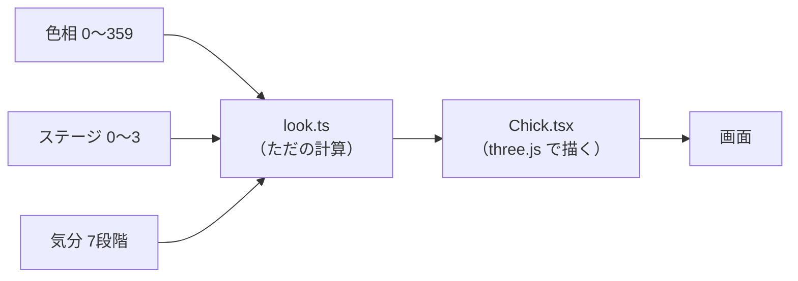
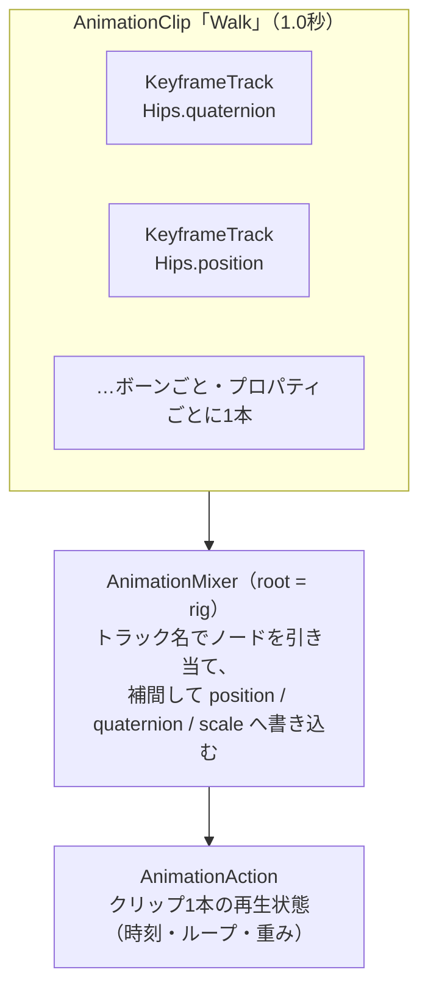
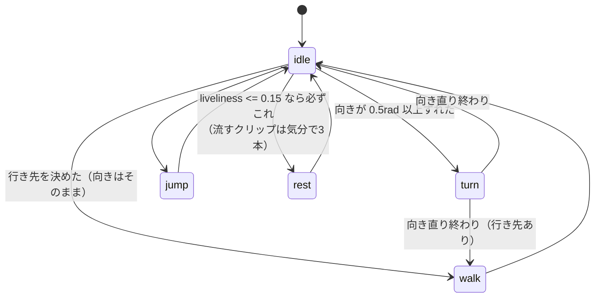
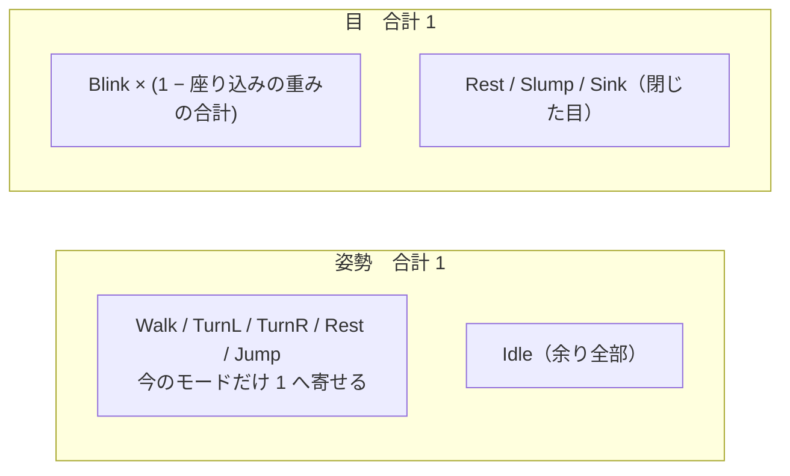

# アバター（3Dのひよこ）

**形と動きは Blender のモデル、色・表情・装備の出し入れはコード。**
姿勢はすべてモデル内のクリップで、コードは「どれを流すか」と「どこへ歩くか」だけを決める。
（VRM は不採用。人型前提の規格でひよこに合わない）

## ファイルの役割

| ファイル | 中身 | 触る場面 |
| --- | --- | --- |
| `look.ts` | 「ステージ × 気分」→ 見た目パラメータの対応表 | 色・表情・何段階目で何が生えるか |
| `Chick.tsx` | モデルを読む・色を塗る・クリップを流す | 動き、パーツの出し入れ |
| `stage.ts` | 達成の記録 → 成長ステージ（`evolutionOf` / `nextGoalOf`） | 進化の条件 |
| `AvatarCanvas.tsx` | カメラと照明 | 明るさ、アングル |
| `avatar.css` | 表示サイズ | 大きさ |
| `Avatar.tsx` | 入口。遅延読み込みと失敗時の受け止め | ほぼ触らない |
| `models/chick.blend` | ひよこの形とアニメーションの原典 | 形・歩き方そのもの |
| `models/egg_build.py` | たまごの原典。形もクリップも全部この1本が作る | たまごの形・割れ方 |
| `models/*.glb`, `egg.blend` | 書き出したもの。**手で触らない** | — |
| `models/export_*.py` | glb の書き出し | 書き出す内容 |
| `docs/BLENDER_*_NOTES.md` | モデリング／アニメの失敗と解決策 | Blender 側で詰まった時 |
| `docs/EFFECTS_NOTES.md` | エフェクト（シェーダー）の失敗と解決策 | 光・もやの見え方を直す時 |

---

## 見た目

| 入力 | レンジ | 効くもの | 原典 |
| --- | --- | --- | --- |
| 色相 | 0〜359（ユーザーが選ぶ） | 色相だけ。気分では動かさない | `state/logic.ts` の `HUES` |
| ステージ | 0〜3（下がらない） | 体格・装備 | `stage.ts` の `STAGES` |
| 気分 | 7段階（連続／放置サイクルから計算） | 彩度・明度・表情・姿勢 | `state/logic.ts` の `MOODS` |

`look.ts` は上の原典を引いて描画用の値に直すだけ。色を足すなら `HUES` に数字を1つ足す。
ステージと気分は独立なので「究極体なのにぐったり」も成立する。

### 気分

落ち込みは彩度で表し、**明度は 58 より下げない**。

| 気分 | 条件 | 彩度 / 明度 | 目 | ほか | エフェクト |
| --- | --- | --- | --- | --- | --- |
| しずみこみ | 4サイクル放置 | 4 / 58 | 閉じる | 伏せて動かない（`Sink`） | どんより |
| ぐったり | 3サイクル放置 | 8 / 58 | 閉じる | うずくまる（`Slump`） | どんより |
| うつむき | 2サイクル放置 | 18 / 58 | 半目 | あんまり動かない（`liveliness` 0.2） | — |
| すこし元気 | 連続1サイクル | 34 / 66 | まるい目 | — | — |
| 元気 | 連続2サイクル | 44 / 72 | まるい目 | — | — |
| いきいき | 連続3〜6サイクル | 56 / 80 | にっこり ∩ | — | 光の粒 |
| かがやき | 連続7サイクル以上 | 56 / 80 | にっこり ∩ | — | 輝き＋光の粒 |

- 前かがみ（`droop`）は `liveliness` から出す。0.6 以上でまっすぐ
- 座り込む閾値は `liveliness <= 0.15`（`Chick.tsx` の `pick()`）。うつむき（0.2）は座らない
- **落ち込みの2段は色では読めない。** 彩度はもう下限近く、明度は下げない決まりなので、
  差は座り込むクリップで見せる（`look.ts` の `SIT_OF`）。休憩（`Rest`）は元気なときの
  ひと休みでもあるので、落ち込みに使い回さない
- おなか・くちばし・翼の色は、からだの色から機械的に作る（`accent`）
- エフェクトは3種類で、中身は `Effects.tsx`。どの気分で出すかは `MOODS` の `glow` / `motes` / `gloom`
  - **輝き**（`Glow`）: 背中の後光（ゆっくり回る光の筋）＋からだの発光。粒は出さない（光の粒と分けるため）
  - **光の粒**（`Motes`）: 足元から同じ向きに回りながら立ちのぼり、フェードして消える
  - **どんより**（`Gloom`）: 背中に垂れ込める暗いもや（ノイズの煙）＋ゆっくり沈む暗い粒。光の粒の裏返し
  - Blender の発光やパーティクルは glTF に載らないので、全部 three.js のシェーダーで描く
  - デバッグ画面の「エフェクト」カードで、気分と別に出し入れして見比べられる

### ステージ

| ステージ | 到達条件 | 増えるもの | 実体 |
| --- | --- | --- | --- |
| 0 たまご | 初期状態 | 殻だけ。気分を持たず、色相以外は固定（彩度24 / 明度88） | `egg.glb`（`Egg`） |
| 1 幼体 | 2サイクル連続 | からだ・あし・くちばし・小さいとさか | 常に表示 |
| 2 成体 | 直近5サイクルで4サイクル | つばさ ＋ 一回り大きく ＋ とさかが立派に | `Wing_L` / `Wing_R`、`bodyRadius`、`crestScale` |
| 3 究極体 | 14サイクル連続 | マフラー ＋ 冠 | `Chick.tsx` の `Scarf` / `Crown`（モデルには無い） |

- たまごはダッシュボードに出る。最初の2サイクルを積むまでが殻の中
- 孵化と進化の演出は `MainPage.tsx` が流し、`avatars.seen_stage` で1回だけに絞る
- **とさかはどのステージでも消さない。** 消すとひよこに見えない。成長は大きさで表現
- 目は球ひとつ。`EYE_SQUASH` で縦に潰して表情を作る（形自体を変えるならシェイプキー→モーフ）。
  表情はメッシュの `scale`、まばたきはボーンの `scale` なので掛け合わさる
- ほっぺの赤みと `headRatio` は未使用

### 色

指定した色がそのまま出るとは限らない。照明とセットなので `AvatarCanvas.tsx` に2つの仕掛けがある。

- **トーンマッピングを切ってある**（`flat`）。既定の ACES は明るい色ほど灰色へ寄せる
- **光の強さが 1 ではなく 2 前後。** three.js の拡散反射は明るさを π で割るため、
  強さ1では指定した色の 1/3 ほどにしかならない

---

## 動き

コードに `sin(t)` は1つも無い。動きの正体は**名前付きトラックの重み付き和**。

- **トラックはノード名で当たる。** Blender でボーン名を変えると、そのトラックは黙って外れる（エラー無し）
- 書き込むのはボーンの位置・回転・スケールだけ。メッシュは付いてくるだけなので、
  コード側の処理（目を潰す・翼を隠す・とさかを拡大）と衝突しない
- 同じプロパティを複数のアクションが書くと**重み付き平均**。だから重みの合計を1にする
- 時間を進めるのは `mixer.update(delta)`（`useAnimations` 任せ）。`mixer.timeScale = 0` で時間だけ止まる
- React の関わりは薄い。`useFrame` は再描画を起こさないので、立ち位置や重みは `useRef`

### クリップ

ボーンは9本（Root / Hips / LegL / LegR / EyeL / EyeR / WingL / WingR / Crest）。

| クリップ | 長さ | 中身 | 流し方 |
| --- | --- | --- | --- |
| `Idle` | 2.5秒 | 立ち止まり。ゆっくり呼吸、翼ととさかがわずかに揺れる | ループ。他が0のとき余りを受け持つ |
| `Walk` | 1.0秒（2歩） | 足を交互に運び、胴体が上下＋よちよち左右に揺れる。1歩ごとに翼を開き、とさかが遅れて振れる | ループ。重みで出し入れ |
| `TurnL` / `TurnR` | 0.67秒 | その場の向き変え。小刻みな足踏み＋回る側へ傾ける | ループ。重みで出し入れ |
| `Rest` | 3.0秒 | 休憩。お尻で座り、足を前へ・翼をおなかへ、目を閉じて深い呼吸 | ループ。重みをゆっくり寄せる |
| `Slump` | 4.0秒 | 3サイクル放置。**前へ**倒れてうずくまり、翼を垂らす。浅くゆっくりした呼吸 | ループ。休憩より遅く寄せる |
| `Sink` | 5.0秒 | 4サイクル放置。腹が床に着くまで倒れ、とさかも前へ落ちる。ほとんど動かない | ループ。いちばん遅く寄せる |
| `Jump` | 1.25秒 | しゃがむ→翼を開いて跳ぶ→足をたたむ→着地で潰れる | 1回きり（`LoopOnce`） |
| `Poke` | 0.71秒 | **叩かれた反応。** 溜めなしで仰け反り、翼を開いて、あとは揺り戻すだけ | 1回きり |
| `Cheer` | 1.25秒 | **叩かれた反応。** 翼をぱたぱたさせながら小さく2回跳ねる | 1回きり |
| `Wave` | 1.08秒 | **叩かれた反応。** 左翼だけ上げて2往復振る。腰は反対へ傾けて釣り合いを取る | 1回きり |
| `Blink` | 4.0秒 | 4秒に1回、目のボーンを縦に潰す | ループで流しっぱなし |

たまご（`egg.glb`。ステージ0でだけ読む別のモデル）。

| クリップ | 長さ | 中身 | 流し方 |
| --- | --- | --- | --- |
| `EggIdle` | 2.5秒 | 左右にゆっくり揺れる（5度） | ループ。既定 |
| `EggCrack` | 3.0秒 | 中から3回突かれてひびが入り、上半分が飛んで横に転がる | 1回きり。`hatching` が true になった瞬間 |

- 殻は `Shell_Bottom` / `Shell_Top` の2つ。割れ線で分かれているが頂点は完全に一致するので継ぎ目が開かない
- 割れ終わりは `clampWhenFinished` で止まる。もう一度見せるにはアバターを作り直す（デバッグ画面の「戻す」は `key` を変えている）
- 翼ととさかは歩き・跳びと同じ周期。別周期にすると歩きと無関係にひらひら見える
- 向き変えが左右2本なのは傾ける向きが逆だから。傾きをコードで足すと動きの出どころが2つになる
- 座り込む・立ち上がるはモデルに無い。`Idle` と座り込みの姿勢差が、重みを寄せる間にそのまま動きになる
- 休憩は背中側へ倒れ、落ち込みは前へ倒れる。**倒す向きが逆**なので1本では兼ねられない
- 沈み量は目分量で決めない。胴体の最下点が床に触る値を、呼吸のいちばん低いフレームで
  測って出す。**前傾を強めるほど腹が下がる**ので、前傾と沈み量はセットで決め直す
- パーツはスキニングせずボーンに親付けした剛体
- **叩かれた反応の3本は目を動かさない。** 目を書くクリップは `EYE_CLIPS` と重みを取り合う決まりで、
  ここに増やすと `Blink` との配分を考え直すことになる。表情は `look.eye` の潰しと `Blink` に任せている
- **翼を上げるときは x と z を同じだけ逆に回す。** 翼ボーンは外へ寝ているので、x だけで回すと
  上がらずに後ろへ逃げて、正面からは動いて見えない（`Wave` を作るときに実測して分かった）
- **左右のリグは厳密な鏡ではない。** 四元数の y/z を反転しても右翼は左翼の鏡にならないので、
  両翼を揃えたいときは既存クリップと同じく x だけで回すこと

### どれを流すか（`pick()`）

- 立ったまま回すと足が滑って見えるので、ずれていたら必ず `turn` を挟む
- `animate` が false（OSの「視差効果を減らす」）なら `mixer.timeScale = 0` にしたうえで
  **状態機械ごと停止。** 重みを寄せ続けると、時間が止まっていても姿勢が動く

### 重みの配り方

姿勢のクリップは全部流しっぱなしで、合計1になるよう重みを配る。目は姿勢と別枠。

- 余りを `Idle` が受けるので「何も流していない素の姿勢」で固まることがない
- 寄せる速さはクリップごと（`RATE`）。休憩は遅く（座り込む間合い）、ジャンプは速く
- 目を書くクリップは `Blink` と座り込む3本（`Rest` / `Slump` / `Sink`）だけ（`EYE_CLIPS`）。歩きながらまばたきさせるため姿勢の取り合いに入れない
- **座り込みの重みの合計ぶんだけ `Blink` を下げる。** 両方を重み1で流すと、開いた目（1.0）と閉じた目（0.08）が平均されて半目で止まる

### どこへ歩くか（`roam()`）

Walk クリップ自体はその場の足踏み。歩き回らせているのは `roam()`。

- 範囲は `ROAM_X` / `ROAM_Z`。端まで来たら中心へ向き直して戻る。
  **カメラや `avatar.css` の比率を変えたら測り直すこと**
- 奥行きは遠近で大きさが変わるので左右より狭い。立ち止まると正面（カメラ向き）に向き直る
- 進む量は Walk の重みに比例（歩き出しと止まりぎわの滑り防止）
- 進む方向は `heading`（行きたい方向）ではなく `facing`（いま向いている方向）。振り向く途中の横滑り防止
- 移動だけは Blender に置けない（毎回同じ道順になり、範囲も決められない）。**姿勢はクリップ、道順はコード**

### 時間で動かないもの

`look.ts` が決める状態。

| もの | やっていること |
| --- | --- |
| 前かがみ | `look.droop * 0.12` を外側 `group` の `rotation.x` へ |
| 目つき | `EYE_SQUASH` の倍率で目を縦に潰す |
| 体格 | `look.bodyRadius * SIZE` を `rig` の `scale` へ |
| たまご | ステージ0では殻だけ。`hatching` を渡すだけ |

## 触る（`interactive`）

ダッシュボードだけ、ひよこを叩けるようにしてある（`MainPage.tsx` の `interactive`）。
叩くと `REACTIONS`（`Poke` / `Cheer` / `Wave`）から1本を引いて流す。

役割の分かれ目はこう。

| やること | どこが持つ |
| --- | --- |
| 叩かれたのに気づく（当たり判定） | **コードだけ。** glb に入力の概念は無い |
| どれを流すか・いつ終わるか | コード（`poke` と `pick`） |
| 叩かれたときの**ひよこ自身の動き** | **Blender のクリップ**（`Poke` / `Cheer` / `Wave`） |

決めごとが3つある。

1. **当たり判定はモデルではなく、別に置いた透明な箱で取る。** スキンメッシュの当たり判定は
   素の姿勢の大きさで測られるので、歩いている途中や座り込んでいる間にずれる。
   `visible={false}` にすると当たり判定からも外れるので、「見えているが何も描かない」材質にしてある
2. **枠いっぱいのときは CSS が `pointer-events` を切っている**（`avatar.css` の `.avatar-fill`）。
   `.avatar-interactive` で戻さないと、クリックがキャンバスに届かない
3. **「視差効果を減らす」設定のときは動かさない。** 跳ねる・仰け反るはまさにその設定が避けたい動きなので、
   姿勢のクリップと同じ扱いで止める

叩かれたときの流し方（`react` モード）。

- **再描画は起こさない。** どれを流すかは毎フレーム見る側の持ち物なので、ref に書いて状態機械へ渡すだけ
- **直前と違うものを引く。** 同じ動きが2回続くと、反応ではなく決まった演出の再生に見える
- **気分や時間の都合より優先する。** `pick()` の先頭で受けているので、歩いている途中でも割り込む
- 連打されたら前の1本を `stop()` してから鳴らし直す。止めないと最終フレームの姿勢を
  重み1で押さえ続けて、次の動きと半々に混ざる（`Jump` と同じ落とし穴）
- 終わったあとは 0.8〜2.0 秒あけてから次の行動へ。すぐ歩き出すと叩かれたことを忘れたように見える

---

---

## いじる時の決まりごと

1. **新しい動きはコードではなく Blender に足す。** `sin(t)` で角度を作らない（例外は `roam()` だけ）。
   足すならアクションを1本増やし、`pick()` の条件と `POSTURE` への登録だけ書く
2. **クリップは `play()` しっぱなしにして重みで出し入れ。** 毎回 `play()` / `stop()` だと歩き出しと止まりが瞬間的になる。
   ジャンプだけ例外で `reset().play()` し、**終わったら必ず `stop()`**（放置すると最後の姿勢を重み1で押さえ続ける）
3. **モデルの中の座標は実測した定数を使う。** `FOOT_Y` / `HEAD_TOP` / `BODY_R` は chick.glb の実測値。
   マフラーや冠はこれを基準に置く。形を大きく変えたら測り直す
4. **マテリアルはパーツ名で引いている**（`Body` / `Beak_Orange` / `Wing_Green` …）。Blender で改名すると黙って色が付かなくなる
5. **色はカンマ区切りの `hsl()` で書く。** `hsl(50 80% 70%)` は three.js が解釈できず黙って白になる。`look.ts` の `hsl()` ヘルパーを通す
6. **パーツはボーンに親付け。スキニングしない。** スキンドメッシュにすると `scene.clone(true)` がボーンを共有し、
   全アバターが同じ動きになる（`SkeletonUtils.clone` が要る）
7. **ボーン名はメッシュ名と必ず変える。** glTF では同じ名前空間に並ぶので、`Body` ボーンと `Body` メッシュがあると
   `getObjectByName` とトラック解決が壊れる
8. Blender の書き出しは**どのアクションにも全ボーンのキーを焼く**。そのままだと `Blink` の脚や胴が歩きを引き戻すので、
   `Chick.tsx` でトラックを名前で振り分けている。ボーンを足す・目を動かすクリップを増やすときは
   この振り分け（`clips` の `useMemo`）と `EYE_CLIPS` を見直すこと
9. **叩いて返す動きを増やすときは `REACTIONS` に足す。** Blender に1本足して `POSTURE` にも並べ、
   `ONE_SHOT`（`Jump` と同じ作り）として鳴らすこと。**目を動かすクリップにしないこと**（→「触る」）
